# STEP 01: 환경 설정

이번 단계에서는 워크샵 진행을 위한 환경을 구축합니다. 

## 1.1 Power BI Service 로그인 하기

1. 최신 버전의 Microsoft Edge 또는 Google Chrome 브라우저를 실행합니다.

2. `Ctrl + Shift + n`을 눌러 Microsoft Edge의 InPrivate 모드 또는 Google Chrome의  Incognito 모드를 실행합니다.

```{Tip} 
Power BI Service를 이미 사용 중인 경우 노트북에 회사 또는 학교 계정으로 로그인 되어 있을 수 있으므로, 로그인 되어 있지 않은 InPrivate/Incognito 모드를 통해 워크샵을 진행할 예정입니다.
```

3. `https://app.powerbi.com/` 으로 접속합니다.

4. 로그인 화면에서 안내받은 이메일을 입력하고 `Submit` 버튼을 클릭합니다.
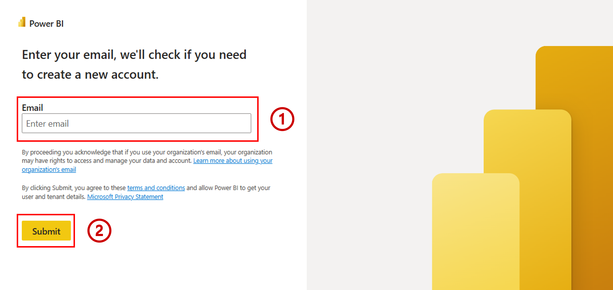

5. 안내받은 비밀번호를 입력하고 `Sign in` 버튼을 클릭합니다.
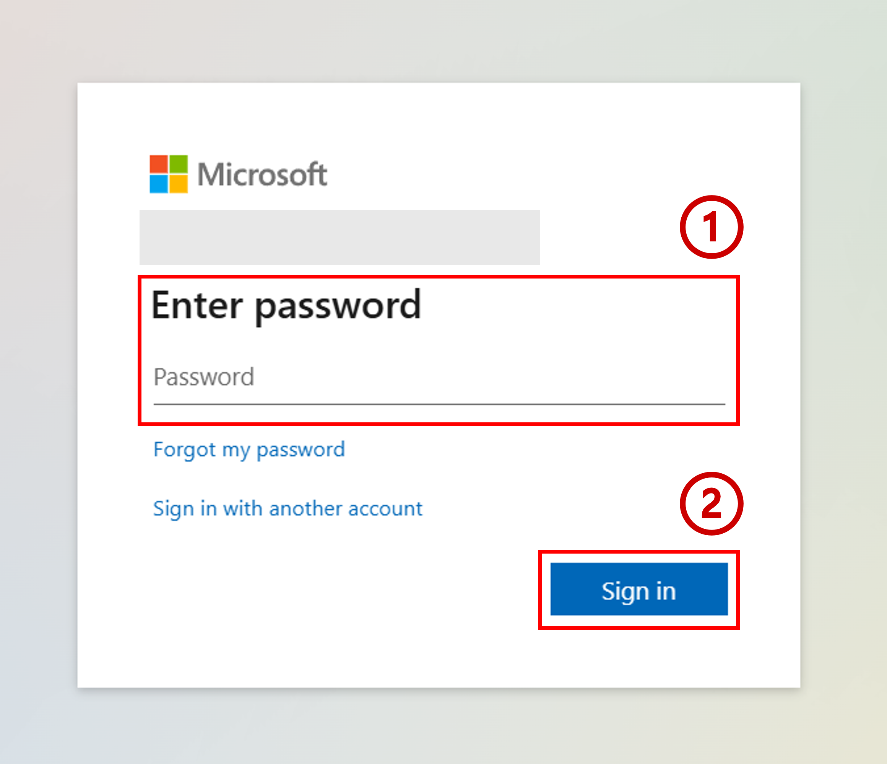

6. 아래와 같은 Action Required 화면이 나오면 `Ask later` 버튼을 클릭합니다. 
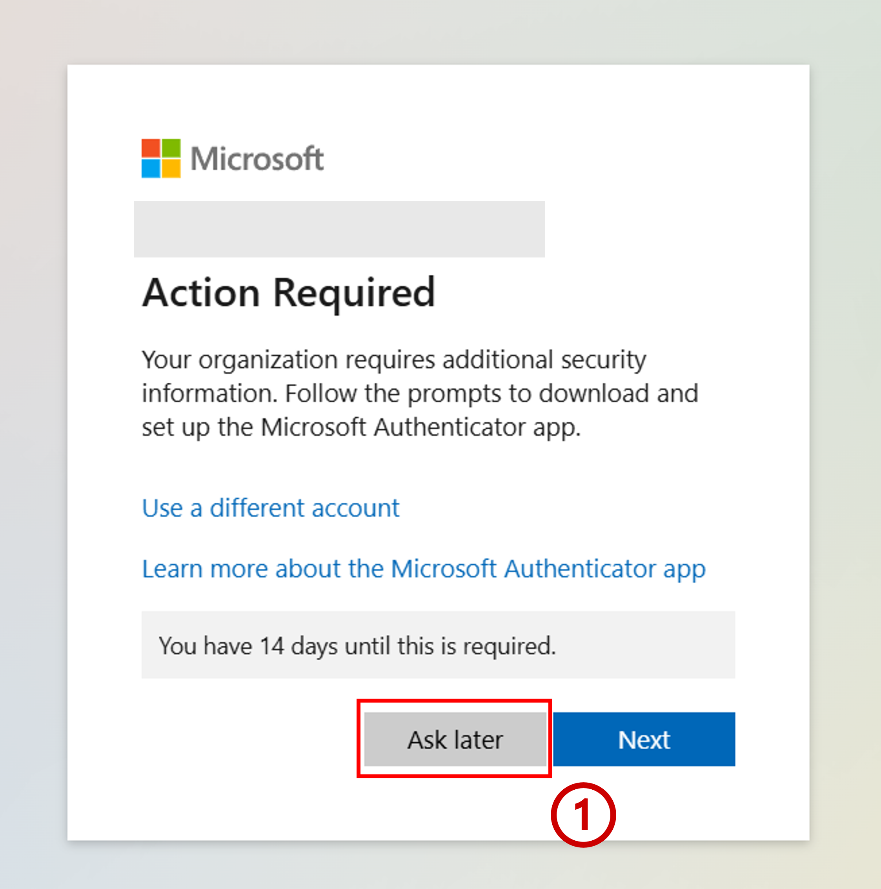

7. 아래와 같은 Stay signed in? 화면이 나오면 `Yes` 버튼을 클릭합니다.
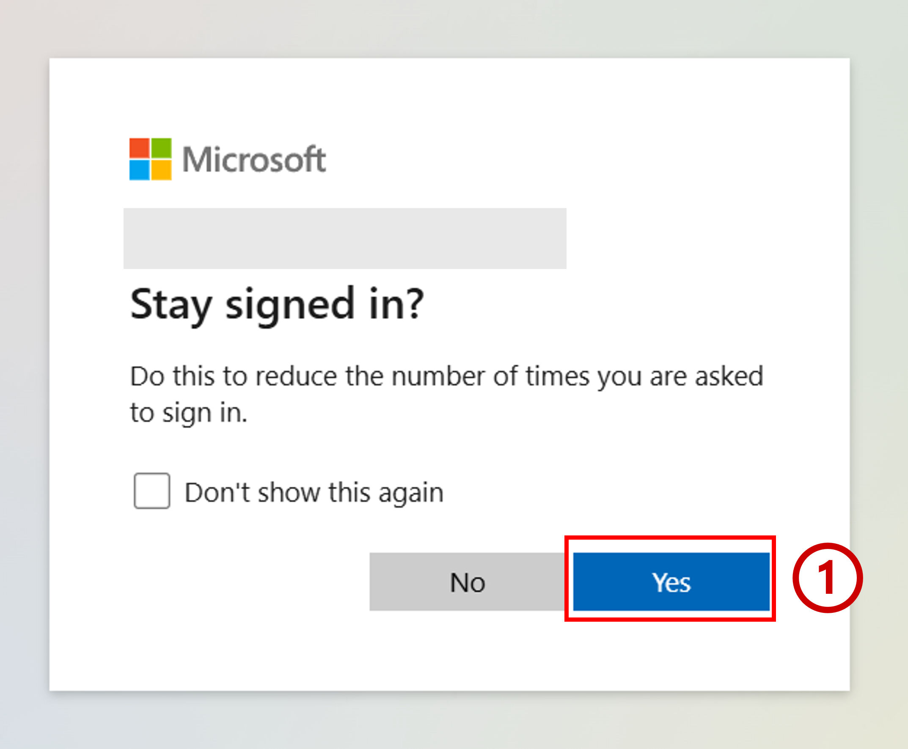

## 1.2 Power BI Service 언어 설정 바꾸기

1. 아래와 같은 화면이 나오면 정상적으로 로그인을 완료한 것입니다. 만약 아래와 같이 UI가 영어로 나오고 있다면, 언어 설정을 한국어로 바꾸기 위해 우측 상단에 톱니바퀴 모양을 클릭한 후 `General` 버튼을 클릭합니다.
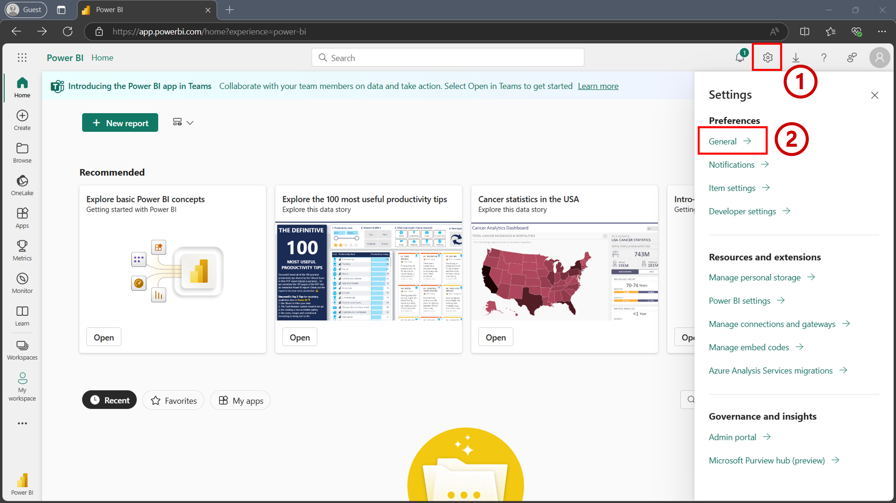

2. 상단에 나오는 `Select display language` 버튼을 클릭하면 `Languages` 목록이 뜹니다. 해당 목록에서 `한국어`를 찾은 뒤 클릭하여 선택하고, 마지막으로 `Select`를 클릭합니다.
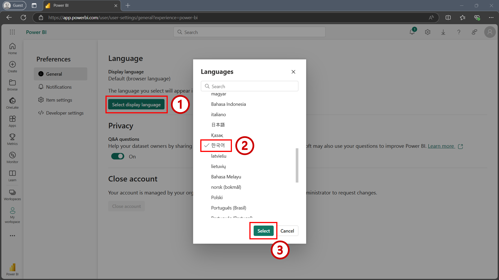

3. 웹페이지가 다시 로드 되면서 UI가 한국어로 바뀐 것을 확인하실 수 있습니다. 
   
## 1.3 실습용 파일 Power BI Service에 업로드하기

1. 실습에 필요한 파일을 Power BI Service에 업로드하기 위해 좌측 메뉴에서 `작업 영역`을 클릭합니다. `작업 영역` 패널이 나타나면 상단에 있는 `내 작업 영역` 버튼을 클릭합니다. 
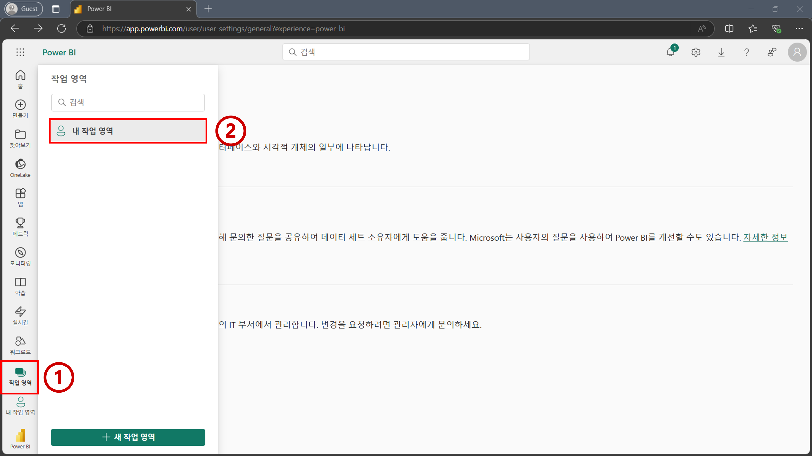

2. `내 작업 영역` 화면으로 이동했을 때 아래와 같은 `작업 흐름 소개(미리 보기)` 팝업창이 뜨면 `확인` 버튼을 눌러 팝업창을 제거합니다.
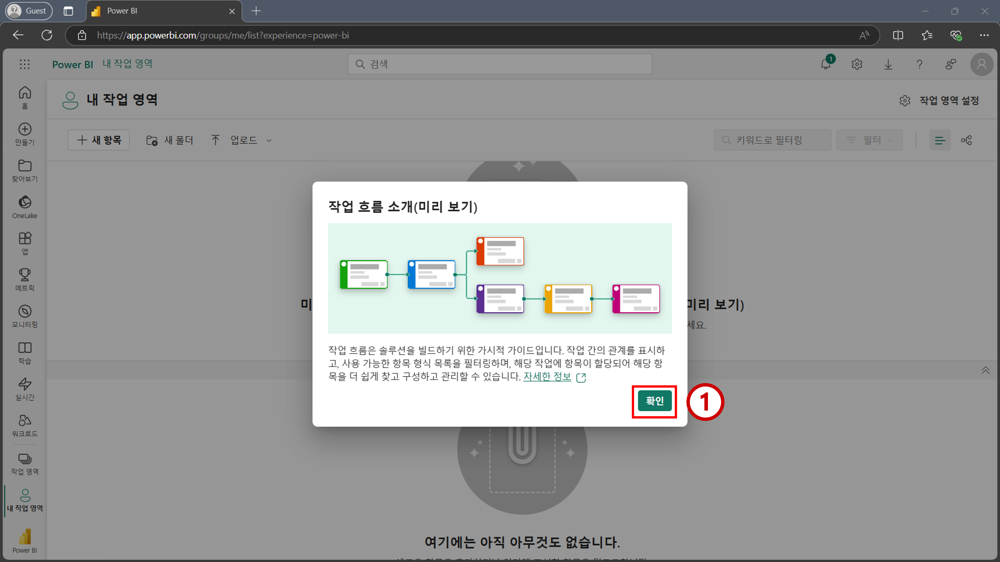

```{Tip}
Power BI Service에 추가된 여러 새로운 기능들을 홍보하기 위해 작업하는 도중 팝업창이 뜰 수 있습니다. 이러한 팝업창은 `확인` 버튼 또는 `X` 버튼을 눌러 없애주시면 됩니다.
```

3. `내 작업 영역`의 화면이 두 개로 분할된 것을 볼 수 있습니다. `작업 흐름 소개`라는 새로운 기능 때문에 분할되어 나타납니다. 해당 기능은 본 워크샵에서는 사용하지 않기 때문에 숨김 처리 할 것입니다. `작업 흐름 표시 또는 숨기기` 팝업창이 뜨면 `확인` 버튼을 눌러 제거해주고, 우측에 있는 위로 방향 화살표 아이콘을 클릭해 줍니다. 화면이 통합된 것을 확인하실 수 있습니다. 이제 실습에 필요한 파일을 다운로드 받기 위해 브라우저에서 새로운 탭을 실행합니다.
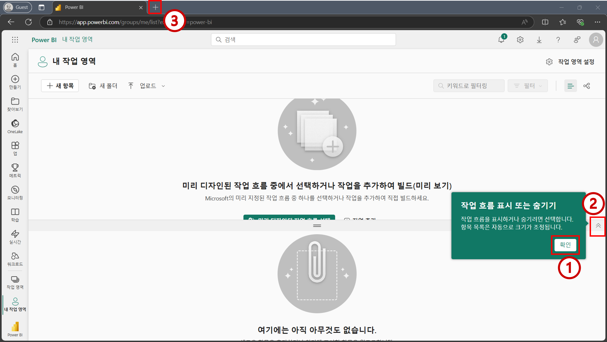

4. 새로운 탭이 열리면 주소창에 `https://github.com/SDSTony/dddseoul-2024-powerbi-olympic-workshop/raw/main/data/dataset-2024-paris-olympic.pbix`를 입력합니다. 엔터를 누르면 `dataset-2024-paris-olympic.pbix`파일이 다운로드 되는 것을 확인하실 수 있습니다. 파일이 다운로드 된 후 해당 탭의 `X`버튼을 눌러 탭을 종료해줍니다. 
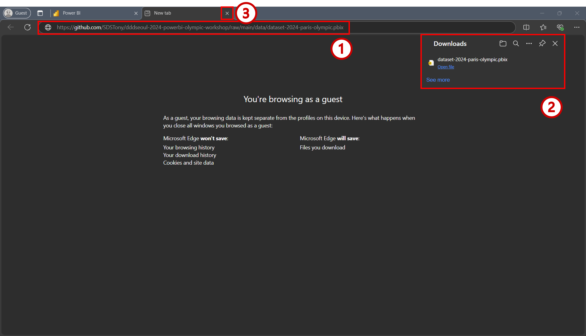

5. `내 작업 영역`이 열려져 있던 탭으로 돌아와서 다운로드 받은 파일을 업로드 하기 위해 `업로드` 버튼을 클릭합니다. 그리고 `찾아보기` 버튼을 클릭합니다.
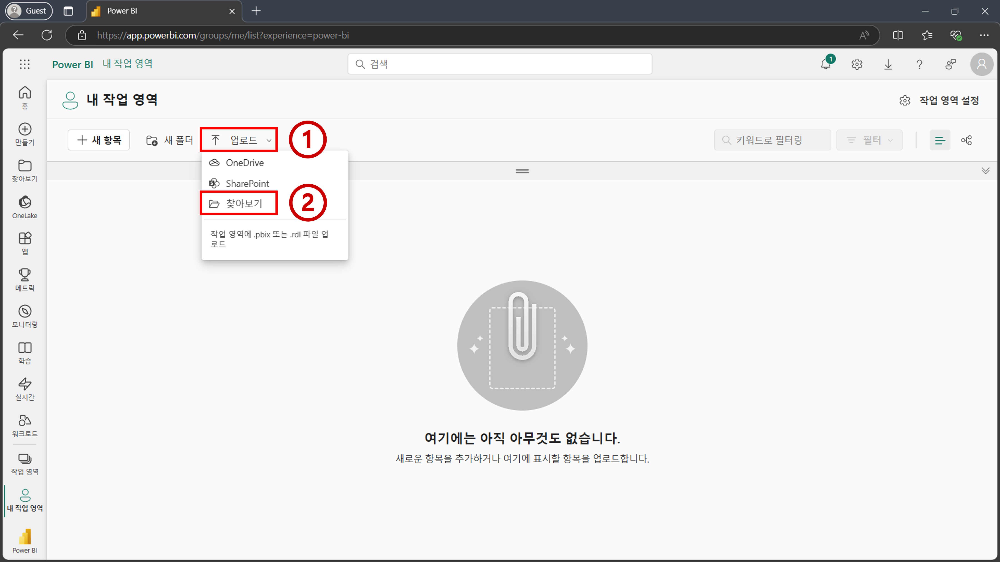

6. 파일 선택 창이 뜨면 앞서 다운로드 받은 `dataset-2024-paris-olympic.pbix`파일이 존재하는 폴더로 이동합니다. 윈도우즈 사용자의 경우 기본 브라우저 설정값으로 사용중이라면 `다운로드` 폴더에 해당 파일이 존재할 것입니다. 적절한 폴더로 이동하여 다운로드 받은 `dataset-2024-paris-olympic.pbix`파일을 선택합니다. 그리고 나서 `Open` 또는 `열기` 버튼을 누릅니다.
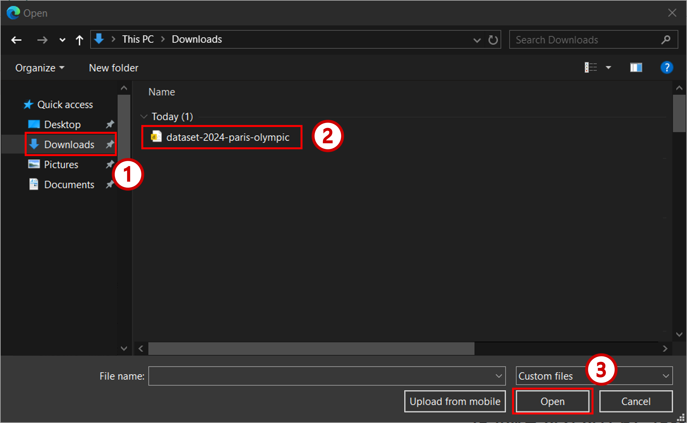

7. 아래 이미지와 같이 두 개의 구성요소가 `내 작업 영역`에 생성됩니다. `dataset-2024-paris-olympic` 보고서가 1개 생성되었고, `dataset-2024-paris-olympic` 의미 체계 모델이 1개 생성되었습니다. 의미 체계 모델에는 데이터들이 저장되어 있으며 해당 데이터를 기반으로 시각화된 결과물들이 보고서에 저장됩니다. 구성요소간 구분을 더 쉽게 하기 위해 보고서 이름을 바꿔주겠습니다. `dataset-2024-paris-olympic` 보고서를 클릭합니다. 
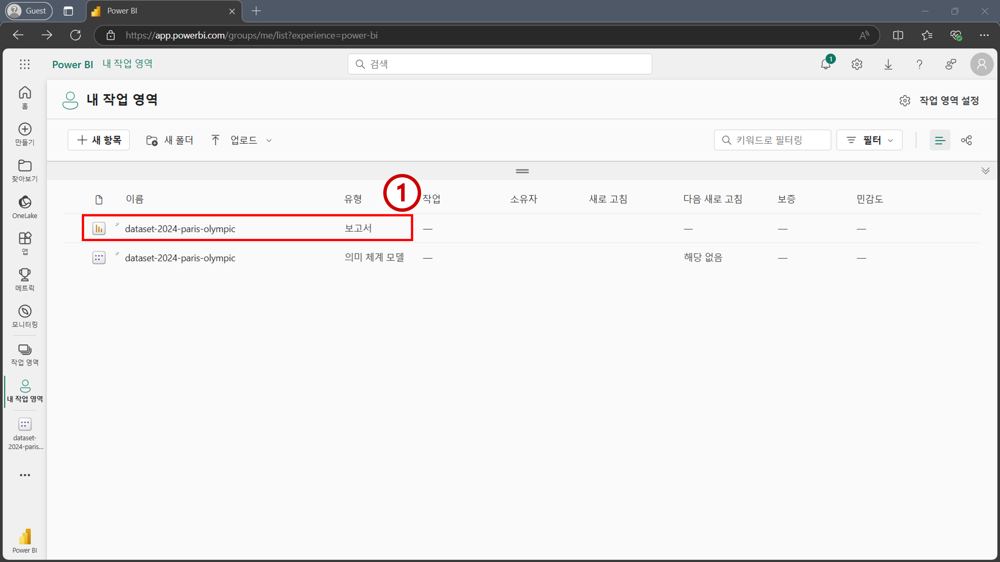

```{Important}
의미 체계 모델이 아니라, 보고서를 클릭합니다. 구성요소 간의 이름이 동일하기 때문에 헷갈릴 수 있습니다.
```

8. 보고서 내부 화면으로 들어오면 좌측 상단에 `dataset-2024-paris-olympic` 이름을 클릭합니다. 이름을 편집할 수 있는 팝업창이 뜹니다. 해당 팝업창에서 이름을 `report-2024-paris-olympic`로 변경합니다. 그리고 팝업창 외부의 하얀색 공간을 아무 곳이나 눌러주면 팝업창이 닫히면서 변경된 이름으로 저장됩니다.
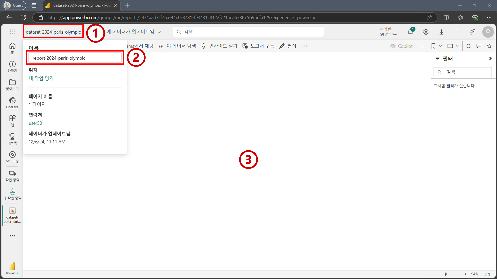

9. 좌측 메뉴 중 `내 작업 영역`을 클릭합니다.
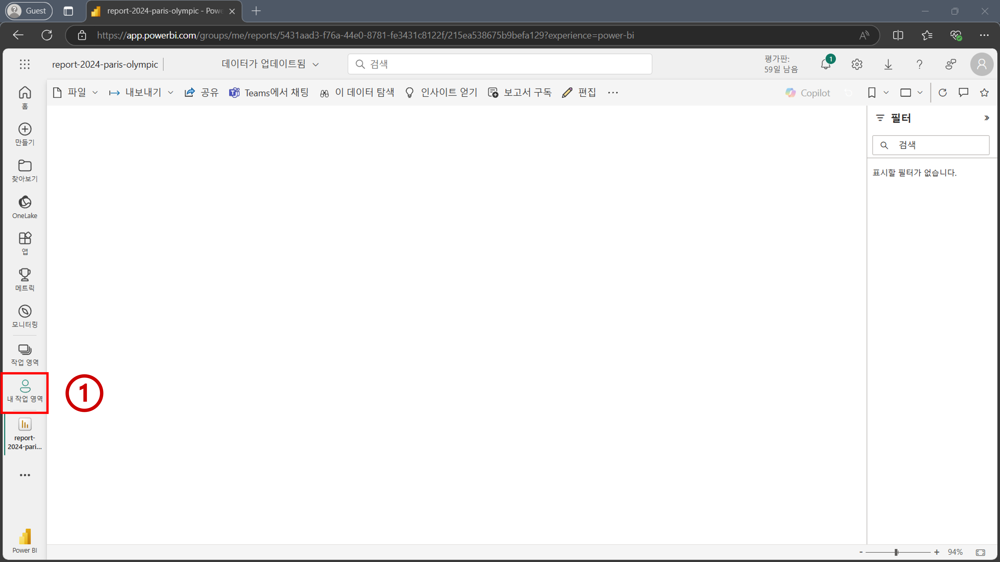

10. `내 작업 영역`으로 돌아오면 아래 이미지 처럼 `dataset-2024-paris-olympic` 의미 체계 모델 1개와 `report-2024-paris-olympic` 보고서 1개가 존재하는 것을 확인하실 수 있습니다. 
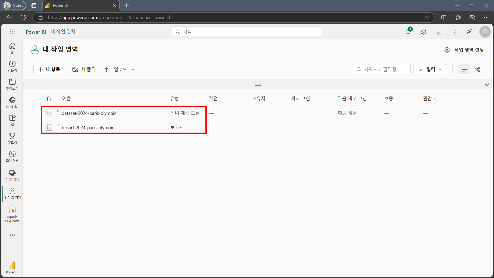

11. 아래 이미지 처럼 `dataset-2024-paris-olympic.pbix` 대시보드 구성요소가 나타날 수도 있습니다. 해당 구성요소는 불필요한 구성요소 이므로 삭제를 해줍니다. `...` 버튼을 클릭한 뒤 `삭제`를 클릭합니다. `대시보드 삭제` 팝업창이 뜨면 `삭제`를 눌러 해당 구성요소를 삭제합니다. 
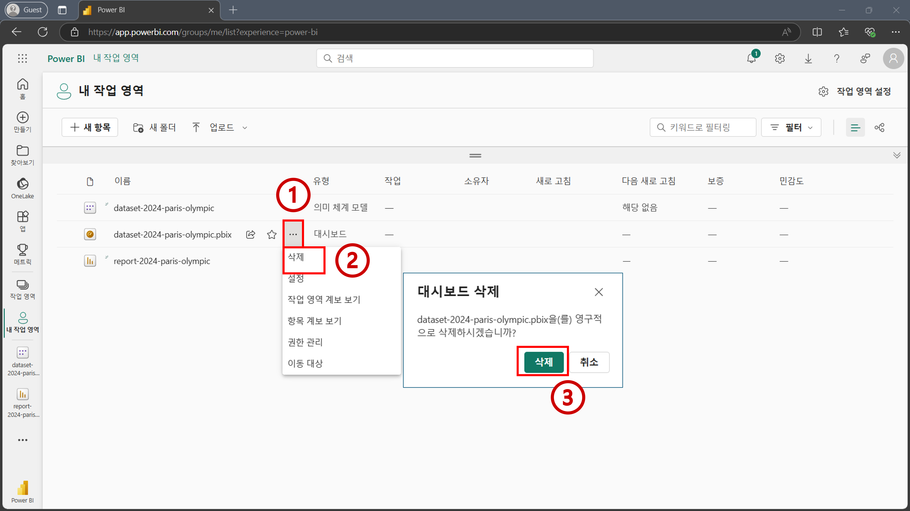

```{Important}
.pbix 확장자명으로된 대시보드가 불필요한 것입니다. 다른 구성요소를 삭제하지 않도록 주의하셔야 합니다.
```

```{Tip}
지금 당장 해당 대시보드 구성요소가 나타나지 않더라도, 다른 작업을 할 때 나타날 수가 있습니다. 나타난다면 삭제를 해주면 됩니다.
```

축하합니다. 환경 설정을 모두 완료하셨습니다. 