# STEP 02: 데이터 모델링

Power BI에서 본격적으로 데이터 시각화를 하기 전에, 데이터 의미에 맞게 데이터 모델링을 적절하게 해주는 것이 중요합니다. 모델링된 데이터 모델을 기반으로 시각화가 진행되기 때문입니다. 

이번 단계에서는 데이터 모델링의 중요성을 알아보고, 2024 파리 올림픽 데이터에 대해 적절한 모델링을 적용합니다.

## 2.1 데이터 확인하기

1. `report-2024-paris-olympic` 보고서는 `dataset-2024-paris-olympic` 의미 체계 모델과 연결되어 있습니다. `dataset-2024-paris-olympic` 의미 체계 모델에는 아래와 같은 데이터들이 존재합니다. 아래 URL들을 클릭해서 데이터 구조를 하나씩 살펴 봅니다. 
   - [countries.csv](https://github.com/EDA-study/2024-paris-olympic/blob/main/data/countries.csv)
   -  [medals.csv](https://github.com/EDA-study/2024-paris-olympic/blob/main/data/medals.csv)
   -  [sports.csv](https://github.com/EDA-study/2024-paris-olympic/blob/main/data/sports.csv)

## 2.2 데이터 모델링 없이 시각화 해보기

1. 시각화를 해보기 위해 `내 작업 영역`에 있는 `report-2024-paris-olympic` 보고서를 클릭하여 내부로 이동합니다.
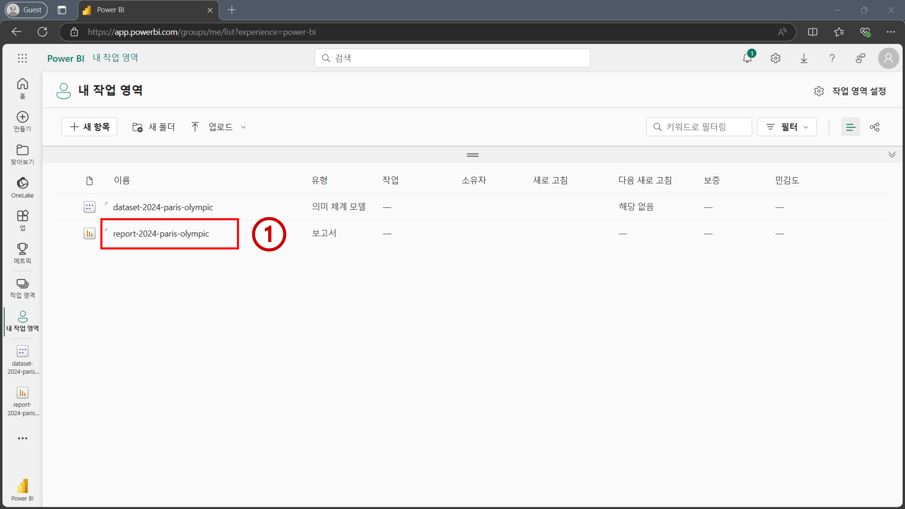

2. 상단 메뉴에 있는 `편집`을 클릭합니다.
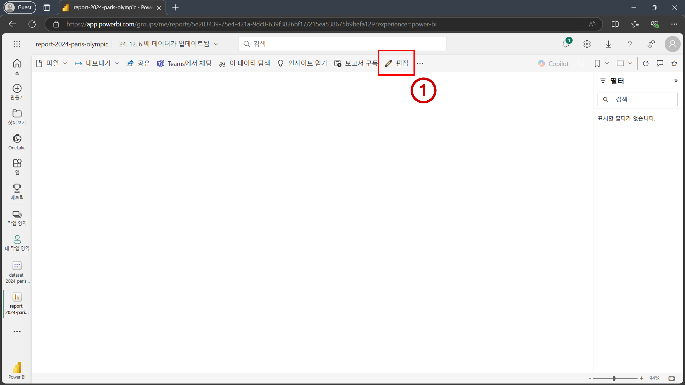

3. 편집 화면으로 이동 한 후, 우측에 있는 `데이터` 패널에 `countries`, `medals`, 그리고 `sports` 테이블이 존재하는 것을 확인합니다. 앞서 `2.1 데이터 확인하기`에서 살펴본 데이터들이 들어가 있습니다. 테이블 내 필드명들을 확인하기 위해 테이블명 왼쪽에 있는 화살표 `>`를 하나씩 클릭해서 테이블을 확장합니다.
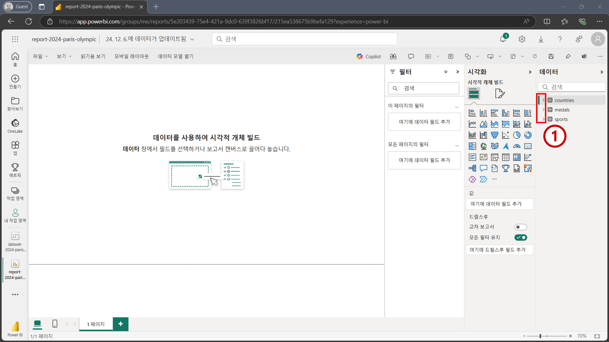

4. 시각화를 하기 위해 시각화 패널의 위에서 5번째 행, 왼쪽에서 4번째 열에 있는 테이블 시각적 개체를 클릭합니다. 왼쪽 빈 화면에 테이블 시각적 개체가 추가된 것을 확인할 수 있습니다. 우측 하단 꼭짓점을 클릭하여 사이즈를 적절하게 확장합니다. 그리고 나서 시각적 개체의 중앙을 한 번 클릭해서 시각적 개체를 선택해줍니다. 
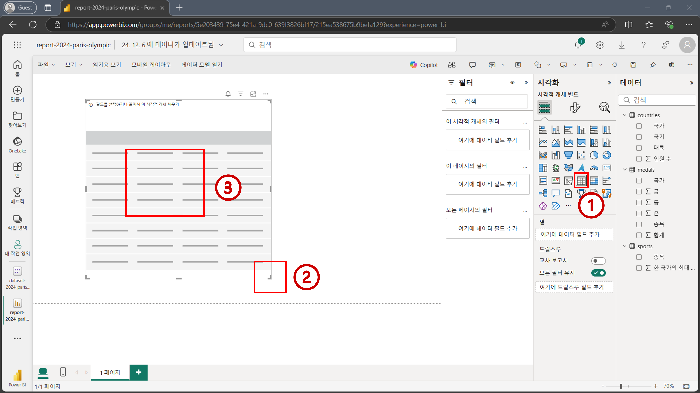

```{Tip}
Power BI 생태계에서는 보고서에 추가되는 다양한 차트들을 "시각적 개체"라고 칭합니다. "시각적 개체"들이 모여 "보고서"가 구축됩니다.
```

```{Tip}
시각적 개체에 필드를 추가하기 전에, 필드를 추가하고자 하는 시각적 개체를 먼저 선택해주어야 합니다.
```

5. 우측 데이터 패널에서 `'countries'[대륙]`, `'medals'[합계]`, `'medals'[금]`, `'medals'[은]`, `'medals'[동]`을 차례대로 눌러 테이블 시각적 개체에 필드를 추가합니다. 폰트 크기가 작기 때문에 우측 하단에 확대 스크롤을 활용해 적절한 정도로 보고서를 확대합니다. 완성된 테이블 시각적 개체를 확인해보면 대륙별로 메달 수가 같은 값들이 집계된 것을 확인할 수 있습니다. (남아메리카 금메달 합계 329, 북아메리카 금메달 합계 329, 등등) 데이터 모델링이 이뤄지지 않았기 때문에 잘못된 집계가 이뤄진 것입니다. 데이터 모델링을 하기 위해 새로운 탭을 엽니다.
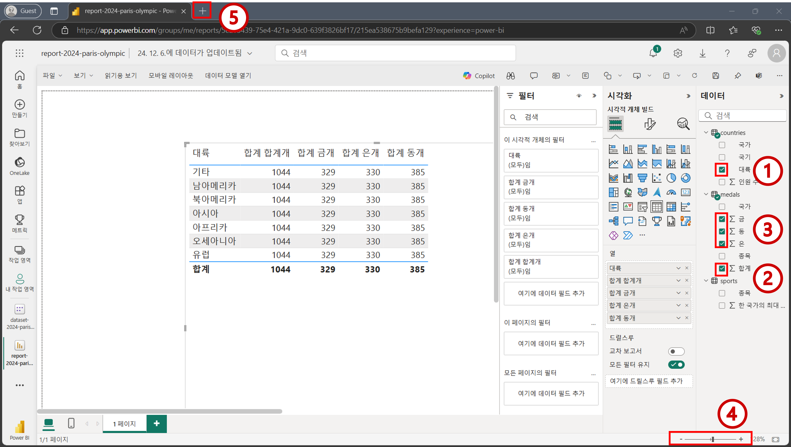

```{Tip}
보고서를 확대하지 않고, 폰트 사이즈를 키우는 방법도 있습니다. 데이터 시각화를 본격적으로 할 때 배워볼 예정입니다.
```

## 2.3 테이블 간 데이터 모델링 진행하기
1. 새로운 탭이 열리면 `https://app.powerbi.com`으로 이동합니다. 그리고 좌측 메뉴에서 `작업 영역`을 클릭한 뒤 `내 작업 영역`을 클릭하여 이동합니다. 
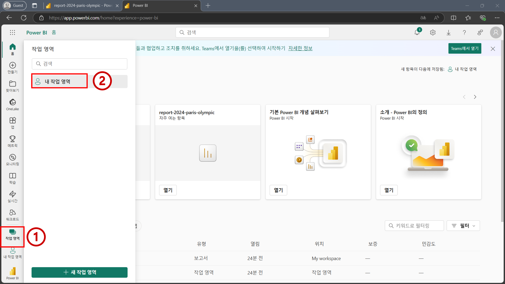

2. `dataset-2024-paris-olympic` 의미 체계 모델을 클릭해서 이동합니다. 
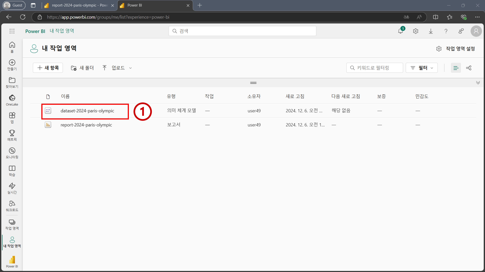

3. 의미 체계 모델 내부로 들어오면 상단 메뉴에 있는 `데이터 모델 열기` 버튼을 클릭합니다.
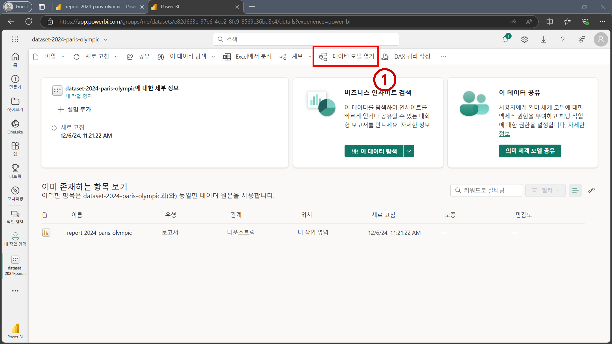

4. 아래 이미지 처럼 `countries`, `medals`, 그리고 `sports` 테이블이 존재하는 것을 확인할 수 있습니다. 현재 테이블 간에는 어떤 관계도 존재하지 않습니다. 데이터 모델링을 위해 테이블 간 관계를 형성하겠습니다. `'countries'[국가]` 필드를 클릭한 상태에서 드래그 하여 `'medals'[국가]` 필드 위에다가 놓습니다.
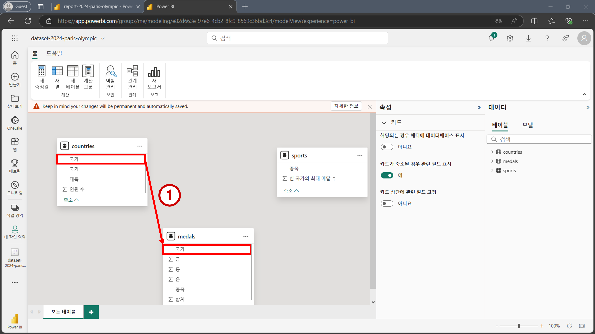

5. 아래 이미지 처럼 `새 관계` 화면이 뜨는 것을 확인할 수 있습니다. 아래와 같은 값들이 잘 입력되고 선택되었는지 확인합니다. 그리고 나서 `저장`을 클릭합니다.
   - `테이블에서`: `countries`
     - `국가` 필드 
   - `테이블로`: `medals`
     - `국가` 필드
   - `Cardinality`: `일대다`
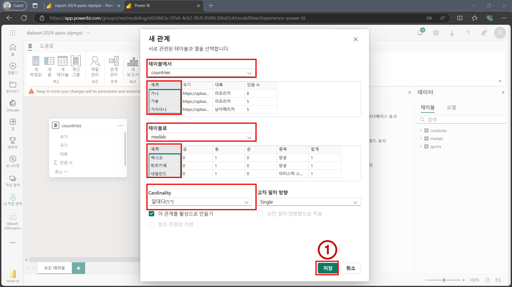

6. `countries` 테이블과 `medals` 테이블 사이에 관계가 형성된 것을 확인할 수 있습니다. `countries` 테이블에서 `medals` 테이블로 향하는 화살표가 중앙에 표시되어 있고, `countries` 테이블에는 `1`, `medals` 테이블에는 `*`이 표시되어 있습니다. 해당 관계에 마우스를 올려보면 각각 테이블에 있는 `국가` 필드가 강조 표시되는 것을 확인할 수 있습니다. 관계 설정이 완료되었기 때문에 브라우저 상단에 탭을 눌러 보고서 화면으로 돌아갑니다. 
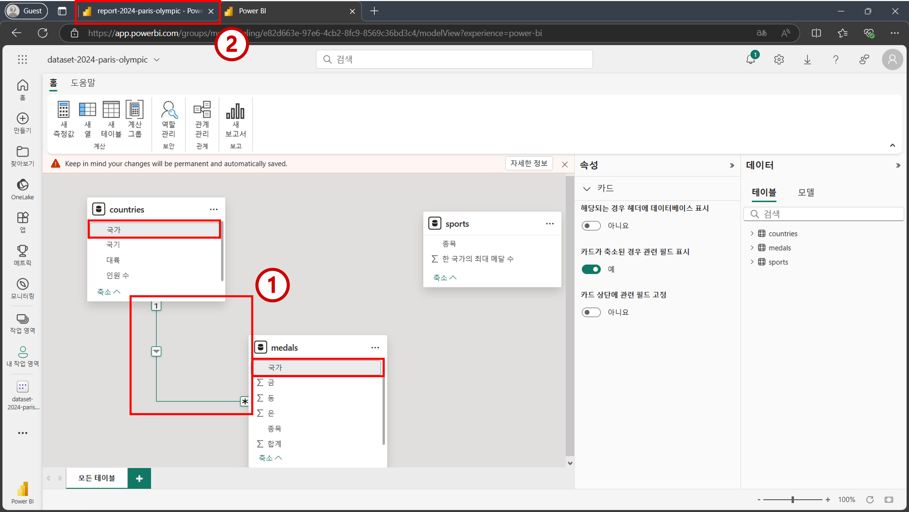

```{Important}
데이터 모델링 작업 하던 탭을 종료하지 마세요. 모델링 작업을 계속 진행할 예정입니다.
```

```{Tip}
의미 체계 모델에서 데이터 모델링을 할 때는 작업하는 내용이 모두 자동 저장 됩니다.
```

7. 보고서 화면으로 돌아오면 테이블 시각적 개체의 값들이 업데이트 된 것을 확인할 수 있습니다. 데이터 모델을 기반으로 얻고자 하는 값들이 집계된 것을 확인할 수 있습니다. 각각의 대륙마다 집계된 값들이 대륙별로 서로 다른 것을 확인할 수 있습니다. 모델링을 마무리 하기 위해 다시 데이터 모델링 탭으로 돌아갑니다.
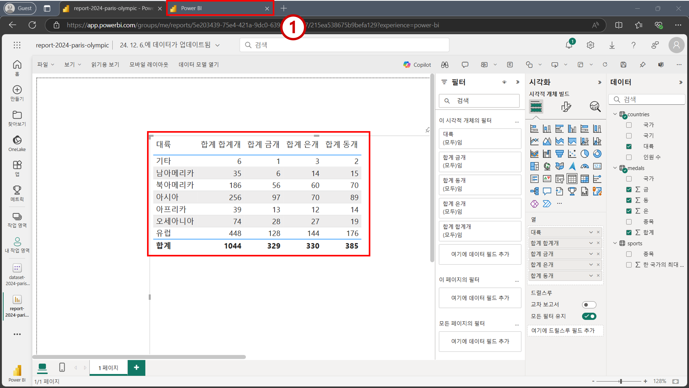

```{Important}
데이터 모델링을 통해 업데이트 된 내용이 보고서 화면에 반영될 때 까지 시간이 조금 걸릴 수 있습니다. 최대 5초 정도까지 기다려 주시면 업데이트 된 내용이 표시될 것입니다.
```

8. 이번에는 `'sports'[종목]` 필드를 마우스로 클릭한 상태에서 드래그 하여 `'medals'[종목]` 필드로 가져다 놓습니다.
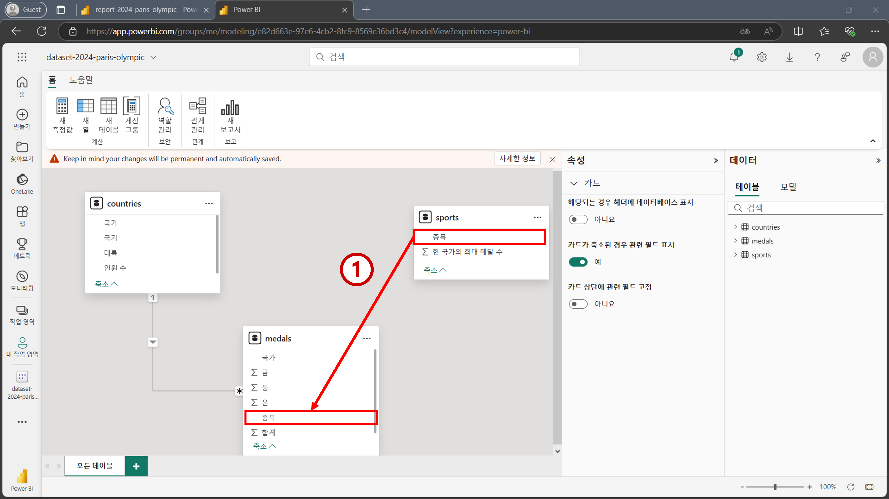

9. 아래 이미지 처럼 `새 관계` 화면이 뜨는 것을 확인할 수 있습니다. 아래와 같은 값들이 잘 입력되고 선택되었는지 확인합니다. 그리고 나서 `저장`을 클릭합니다.
   - `테이블에서`: `sports`
     - `종목` 필드 
   - `테이블로`: `medals`
     - `종목` 필드
   - `Cardinality`: `일대다`
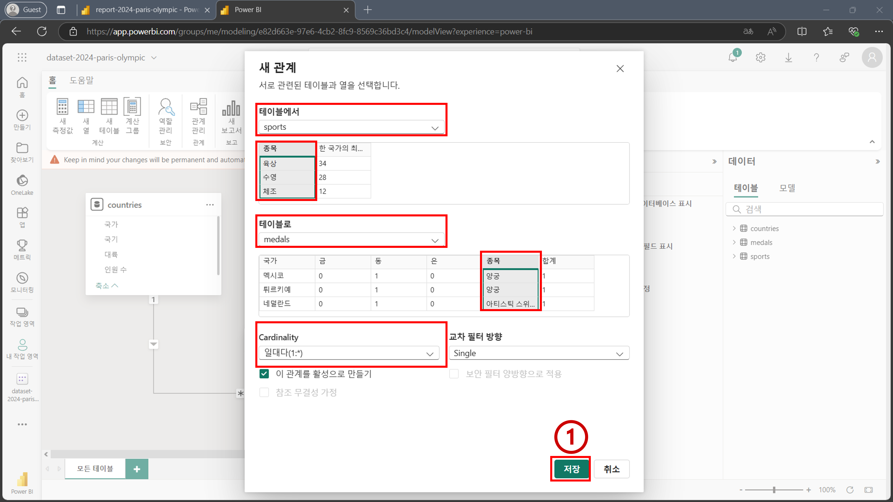

10.  `sports` 테이블에서 `medals` 테이블로 가는 관계가 형성된 것을 확인할 수 있으며, 마우스를 올려보면 각각의 테이블에서 `종목` 필드가 강조 표시되는 것을 확인할 수 있습니다.
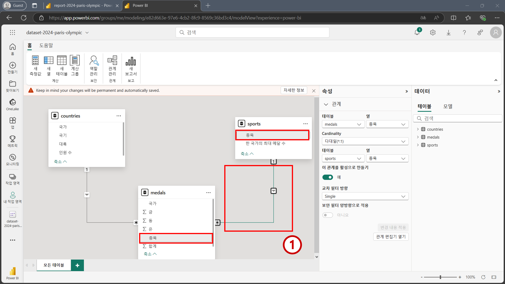

11.  테이블명도 직관적인 이름으로 바꿔주겠습니다. 우측 데이터 패널에서 `countries` 테이블명을 더블 클릭하여 편집 화면을 활성화 합니다. 그리고 `국가 테이블`을 입력한 뒤 엔터를 누릅니다. `medals` 테이블과 `sports` 테이블도 각각 아래와 같은 이름으로 변경합니다. 
     - `medals` -> `국가별 종목별 메달 수`
     - `sports` -> `종목 테이블`  
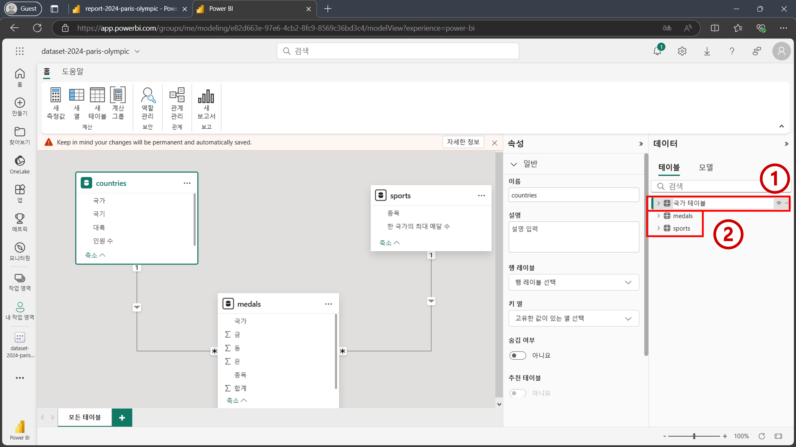

## 2.4 열에 대한 데이터 모델링
테이블 간 관계를 형성하는 것 뿐만 아니라 특정 열의 속성을 편집하거나 열 간의 관계를 정의내리는 것 또한 데이터 모델링의 일부입니다. 이번 단계에서는 열에 대한 데이터 모델링을 진행합니다. 

1. `국가 테이블`을 확장 시킨 뒤 `'국가 테이블'[국기]` 필드를 선택합니다. 그리고 왼쪽의 `속성` 패널에서 스크롤을 내려 `고급` 버튼을 클릭합니다. 그리고 나서 `데이터 범주` 드롭다운 박스를 클릭합니다. 
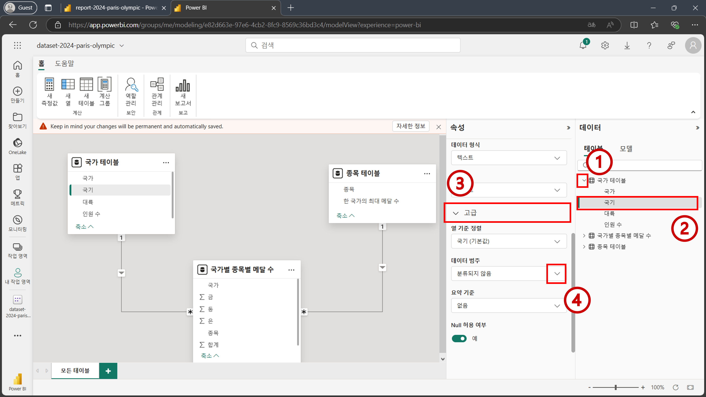

2. `이미지 URL` 버튼을 클릭합니다.
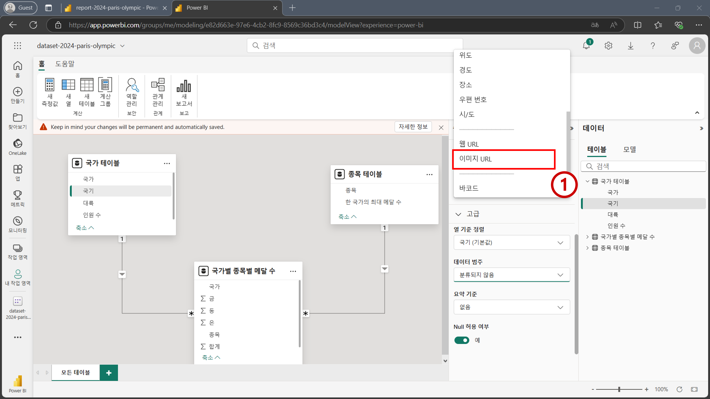

```{Tip}
데이터 범주를 이미지 URL로 바꿈으로써 추후 시각화 할 때 해당 URL에 있는 이미지 파일이 나타납니다.
```

축하합니다. 데이터 모델링 단계를 모두 완료하셨습니다.

