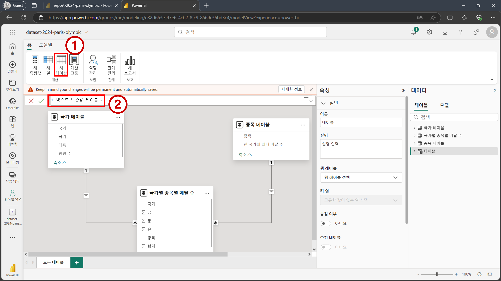
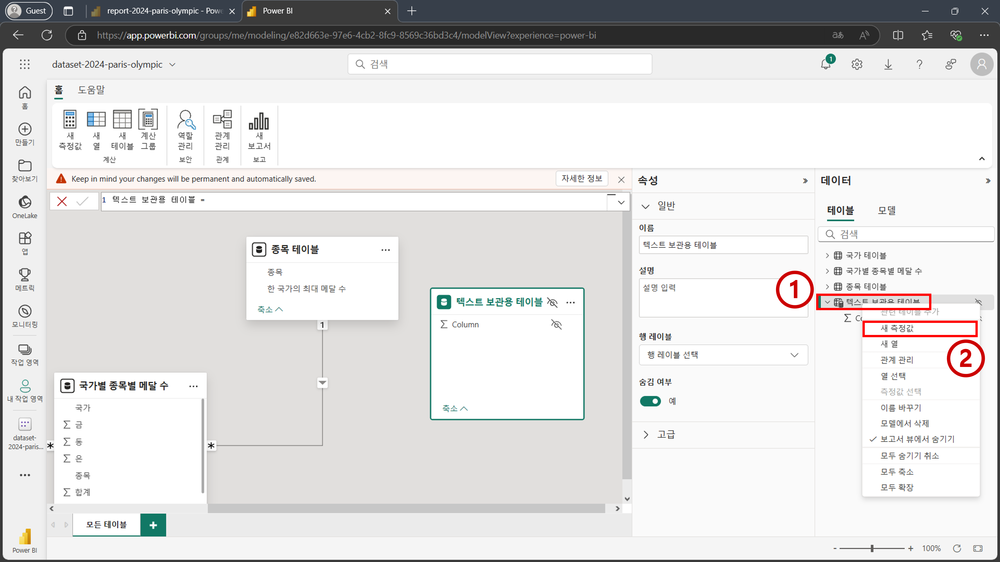
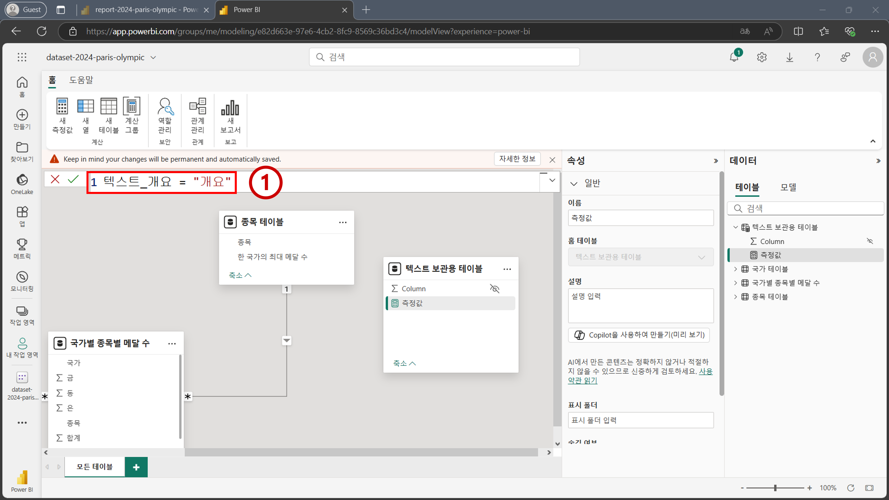
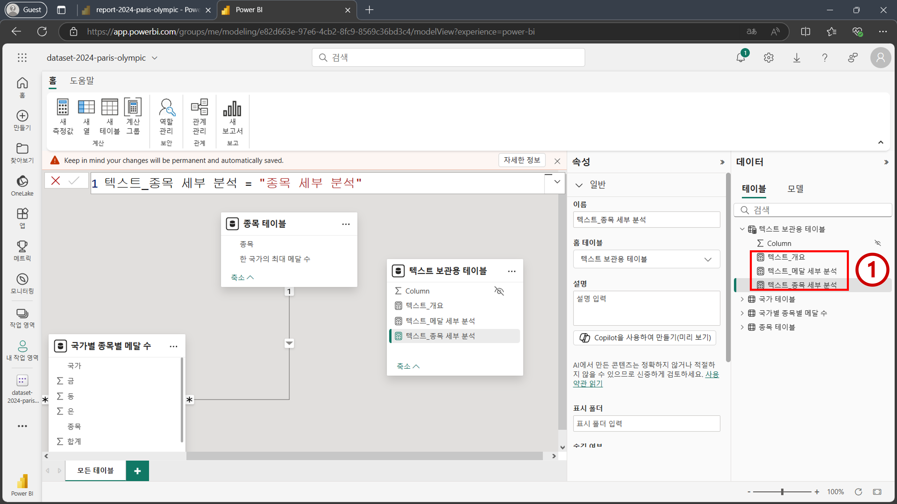
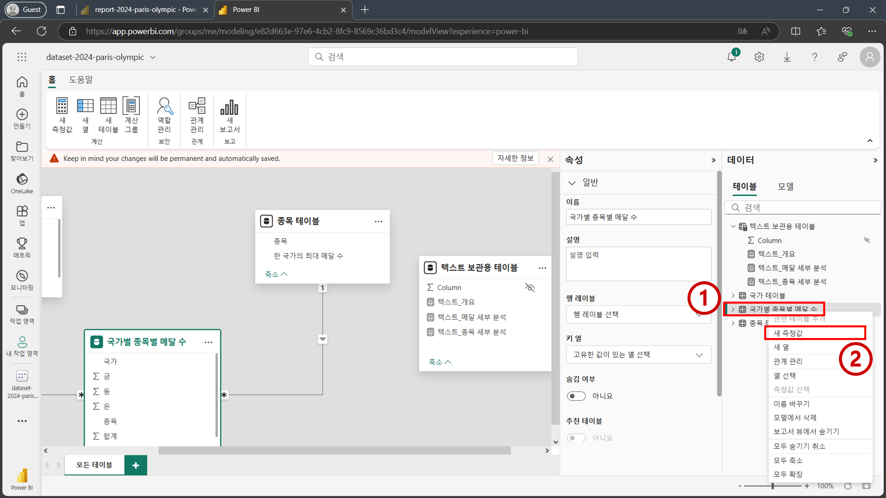
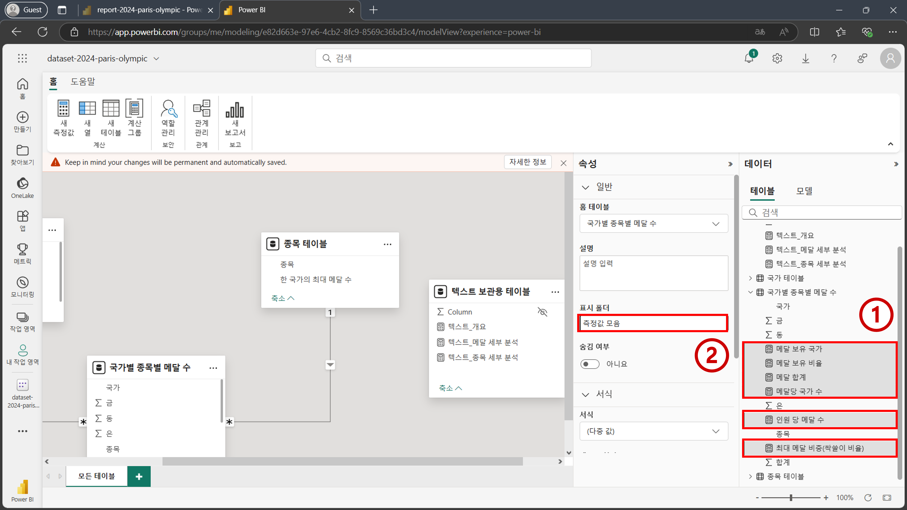
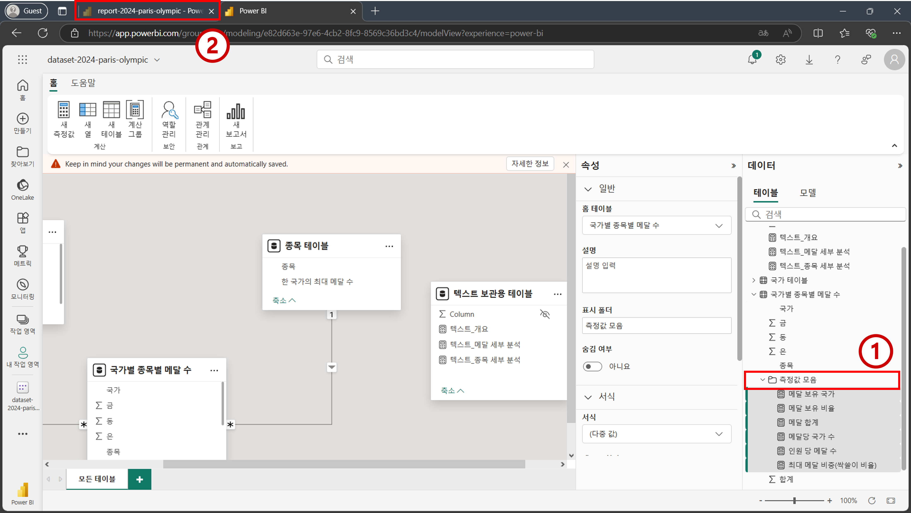
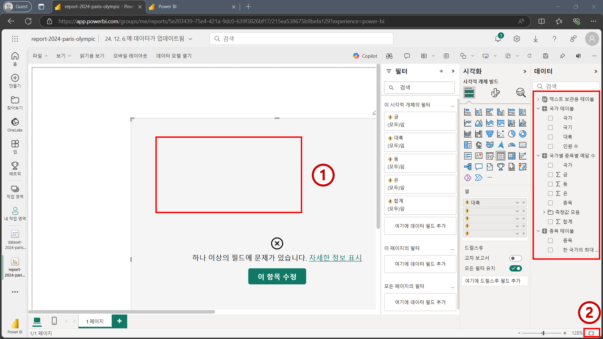
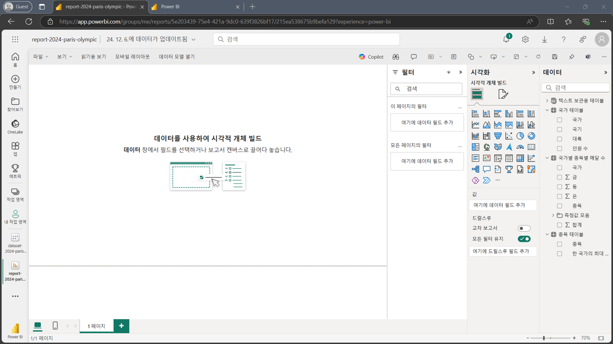

# STEP 03: 측정값 만들기

원본 데이터 소스에서 데이터를 불러와 데이터 시각화 및 분석을 진행하다 보면, 데이터 소스에는 없던 새로운 변수들을 만들어서 시각화 및 분석을 진행해야 할 때가 있습니다. Power BI 생태계에서는 해당 변수들을 `측정값` 기능과 `DAX` 함수를 사용해 만들 수 있습니다. 

일반적인 상황에서는 데이터 시각화 및 분석을 하면서, 필요할 때 마다 그때 그때 적절한 `측정값`을 만들게 됩니다. 허나 이번 워크샵에서는 작업의 일관성을 위해 데이터 시각화를 하기전에 필요한 측정값들을 모두 만들겠습니다.

## 3.1 텍스트만 들어간 측정값 만들기

1. `dataset-2024-paris-olympic` 의미 체계 모델 내에서 상단 메뉴에 있는 `새 테이블`을 클릭합니다. 수식 편집 화면이 뜨면 아래 첨부된 수식을 입력합니다. 그리고 엔터를 누릅니다. 
```
텍스트 보관용 테이블 = 
```


```{Tip}
마우스 커서를 수식 편집 화면에 둔 상태에서 'Ctrl' + '+'를 누르면 수식 편집 화면이 확대 됩니다.
```

```{Tip}
이번 실습에서는 다양한 수식을 사용하게 됩니다. 본 지시사항에 있는 수식들을 복사하여 Power BI Service에 붙여넣기하는 방법으로 작업하시면 편하게 작업이 가능합니다.
```

```{Important}
Power BI Desktop을 사용하면 보고서 편집 화면에서도 측정값을 추가할 수 있습니다. 그렇기 때문에 시각화 작업을 진행하는 도중에 별도로 화면을 전환하지 않고 편안하게 작업이 가능합니다. 허나 Power BI Service에서는 보고서 편집 화면에서는 측정값 추가 기능이 현재 (2024년 12월 기준) 지원되지 않으며 의미 체계 모델 편집 화면에서만 측정값 추가가 가능합니다.
```

2. 우측 `데이터` 패널에 `텍스트 보관용 테이블`이 추가된 것을 확인하실 수 있습니다. `텍스트 보관용 테이블` 테이블명 왼쪽에 있는 화살표를 눌러 테이블을 확장합니다. `Column` 필드가 있는 것을 확인합니다. 테이블을 만들면서 기본으로 함께 만들어진 필드입니다. 데이터 시각화할 때는 필요없기 때문에 숨김 처리를 해주겠습니다. 마우스를 `Column` 필드에 올려둔 상태에서 우측이 뜨는 눈(eye) 모양 아이콘을 클릭합니다. 숨김 처리가 되면 보고서 편집 화면 (`report-2024-paris-olympic`)에서 해당 필드가 보이지 않게 됩니다.


3. `텍스트 보관용 테이블`에 새로운 측정값들을 추가하기 위해 `텍스트 보관용 테이블`을 우측 마우스로 클릭합니다. 팝업창이 뜨면 `새 측정값`을 클릭합니다.


4. 새로운 측정값에 대한 수식 편집 화면이 활성화 되면 아래 수식을 입력합니다. 그리고 엔터를 누릅니다.
```
텍스트_개요 = "개요"
```


5. 우측 `데이터` 패널에 `텍스트 보관용 테이블` 내에 `텍스트_개요` 필드가 추가된 것을 확인할 수 있습니다. 앞서 진행한 3번 4번 과정을 반복하여 두 개의 측정값을 더 만들겠습니다. 각각 아래의 수식을 사용하면 됩니다.
```
텍스트_메달 세부 분석 = "메달 세부 분석"
```

```
텍스트_종목 세부 분석 = "종목 세부 분석"
```


## 3.2 메달 집계 관련 여러 측정값 만들기

파리 올림픽 메달 관련 데이터 시각화 및 분석 진행 시 사용할 여러 측정값들을 만들어 보겠습니다.

1. `국가별 종목별 메달 수` 테이블을 우측 마우스로 클릭한 뒤 `새 측정값`을 클릭합니다.


2. 수식 편집 화면이 활성화 되면. 아래 수식을 입력한 뒤 엔터를 누릅니다. 1번과 2번 과정을 반복하여 새로운 측정값을 총 6개를 만듭니다.

```
메달 보유 국가 = DISTINCTCOUNT('국가별 종목별 메달 수'[국가])
```

```
메달 보유 비율 = [메달 보유 국가] / COUNTROWS('국가 테이블')
```

```
메달 합계 = IF(
                SUM('국가별 종목별 메달 수'[합계]) = BLANK(),
                0,
                SUM('국가별 종목별 메달 수'[합계])
)
```

```
메달당 국가 수 = [메달 보유 국가] / [메달 합계]
```

```
인원 당 메달 수 = [메달 합계] / SUM('국가 테이블'[인원 수])
```

```
최대 메달 비중(싹쓸이 비율) = SUM('종목 테이블'[한 국가의 최대 메달 수]) / [메달 합계]
```

3. `국가별 종목별 메달 수` 테이블 내에 만들어진 총 6개의 측정값들을 동시 선택합니다. Ctrl 누른 상태에서 하나씩 선택하면 동시 선택이 됩니다. 그리고 나서 좌측 `속성` 패널에 있는 `표시 폴더`란에 `측정값 모음`을 입력한 뒤 엔터를 누릅니다.


4. `데이터` 패널을 확인해 보면 `국가별 종목별 메달 수` 테이블 내에 `측정값 모음` 폴더가 생성된 것을 확인할 수 있으며, 해당 폴더 내에 앞서 선택한 6개의 측정값들이 들어간 것을 확인할 수 있습니다. 여러 개의 필드들(측정값 및 열)을 묶어서 관리하고자 할 때 표시 폴더 기능을 사용할 수 있습니다. 상단에 브라우저 탭을 눌러 보고서 편집 페이지로 이동합니다.


5. 보고서 편집 화면 내의 우측 `데이터` 패널을 확인해보면 의미 체계 모델 내에서 편집한 결과물들이 존재하는 것을 확인할 수 있습니다. `텍스트 보관용 테이블`이 추가되었으며, `국가별 종목별 메달 수`에는 `측정값 모음` 폴더가 생성되었으며 해당 폴더를 확장해보면 6개의 측정값들이 존재하는 것을 확인할 수 있습니다. 또한 `텍스트 보관용 테이블`에는 숨김 처리한 `Column` 열은 보이지 않는 것을 확인할 수 있습니다. 

6. 보고서 캔버스를 확인해보면 `STEP 02: 데이터 모델링` 전반부에서 만들어 둔 테이블 시각적 개체에 에러가 발생한 것을 확인할 수 있습니다. 기존에는 영어로된 테이블명을 기반으로 테이블 시각적 개체를 만들어 뒀지만, 모델링 후반부 과정에서 테이블 명을 영어에서 한국어로 변경했기 때문에 해당 필드를 찾지 못해서 발생하는 에러입니다. 해당 시각적 개체는 더 이상 필요하지 않기 때문에 시각적 개체를 클릭한 뒤 키보드에 있는 `Delete` 버튼을 눌러서 삭제합니다. 그리고 나서 화면 우측 하단에 있는 직사각형으로 된 아이콘을 눌러 캔버스 배율을 화면에 맞추어 줍니다.


7. 최종적으로 아래와 같은 화면이 나오면 데이터 시각화를 하기 위한 사전 준비가 모두 완료된 것입니다.



축하합니다. 측정값 만들기 단계를 모두 완료하셨습니다.