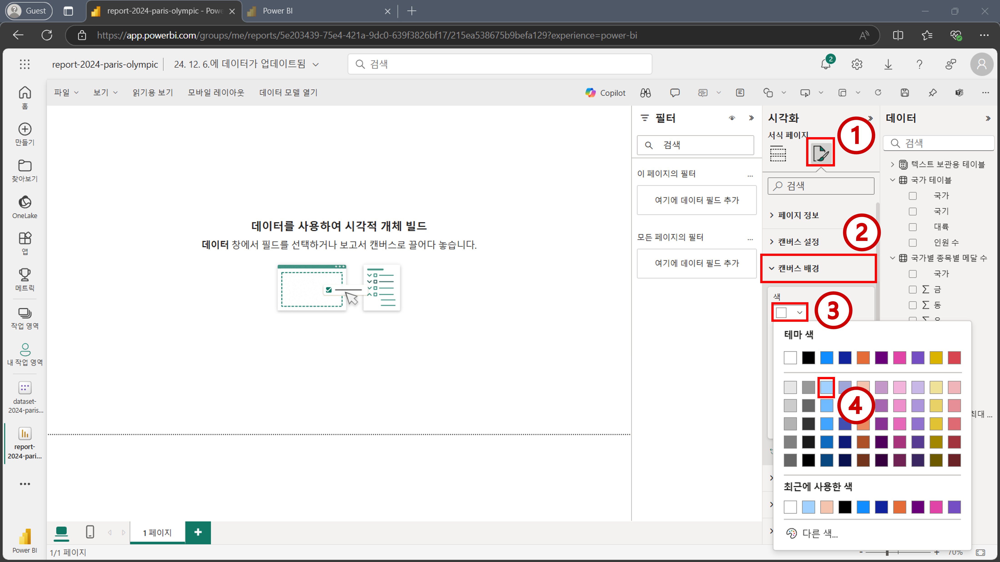
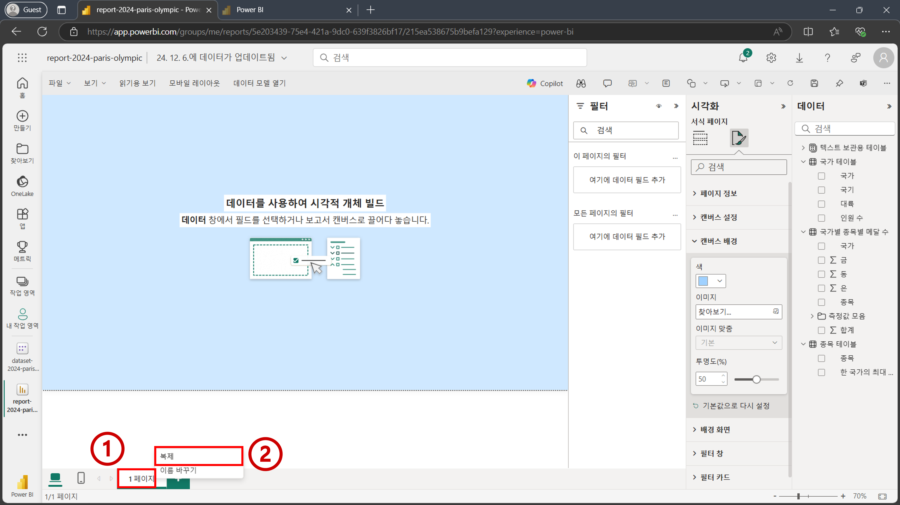
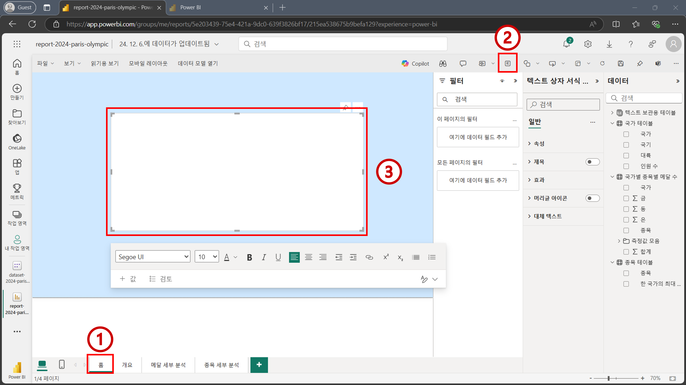
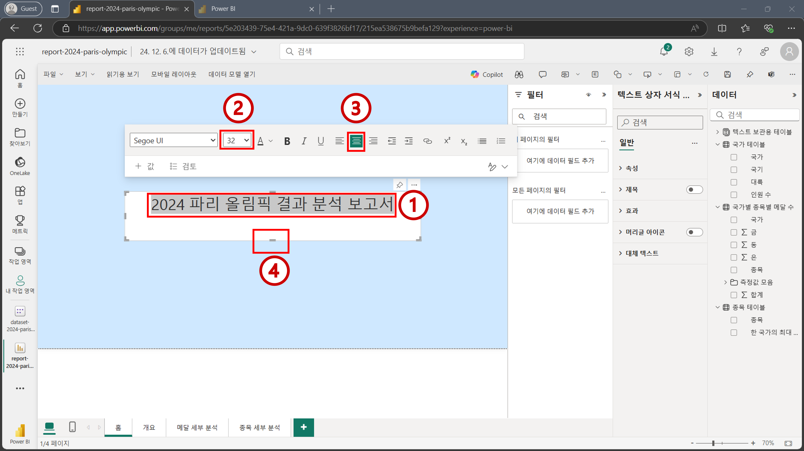

# STEP 04: 데이터 시각화 part1

이제 본격적으로 데이터 시각화를 진행해보겠습니다.

## 4.1 캔버스 배경색 변경

1. 먼저 주어진 캔버스의 배경색을 바꾸기 위해 아래 이미지 순서에 따라 진행하여 캔버스 배경색을 연한 하늘색으로 변경합니다.


2. 색을 선택하더라도 처음에는 `투명도`가 `100`로 되어 있어서 색이 표시가 되지 않습니다. 아래 이미지를 참고해 `투명도`를 `50`으로 편집합니다.


## 4.2 페이지 복사하기

1. 여러 개의 페이지를 만들기 위해 하단의 `1 페이지` 메뉴를 우측 마우스로 클릭한 뒤 `복제` 버튼을 누릅니다. 해당 과정을 반복하여 총 4개의 페이지를 만듭니다.


2. 4개의 페이지가 만들어 졌으면 각각의 페이지명을 더블 클릭하여 페이지명을 수정합니다. 페이지명을 각각 다음과 같이 변경합니다: `홈`, `개요`, `메달 세부 분석`, `종목 세부 분석`


## 4.3 홈 페이지 구축하기

1. 홈 페이지를 구축하기 위해 하단에 `홈` 버튼을 클릭하여 `홈` 페이지로 이동합니다. 그리고 아래 이미지의 2번을 참고해 우측 상단에 있는 `텍스트 상자` 버튼을 클릭합니다. 텍스트 상자가 캔버스에 추가되면 적절한 크기로 조정한 후 상자를 캔버스 중앙에 위치시킵니다.


```{Tip}
Power BI Service에는 시각적 개체를 배치할 때 사용할 수 있는 기능들이 아직까지는 상대적으로 빈약합니다. Power BI Desktop을 사용하면 보조선 기능, 개체간 정렬 기능 등등 보조 기능들을 활용하여 시각적 개체 배치에 도움을 받을 수 있습니다.
```

2. 텍스트 상자에 `2024 파리 올림픽 결과 분석 보고서`를 입력합니다. 폰트 사이즈를 32로 하고 좌우 가운데 정렬을 적용합니다. 그리고 나서 텍스트 상자를 알맞은 크기로 조절합니다.


```{Important}
텍스트 상자는 텍스트를 좌우 정렬 해주는 기능은 있지만 위아래 정렬 해주는 기능은 없습니다. 추후 실습에서는 위아래 정렬 기능이 자동으로 탑재되어 있는 카드 시각적 개체를 활용할 예정입니다.
```

축하합니다. 데이터 시각화 첫번째 파트를 모두 완료하셨습니다.