# STEP 06: 데이터 시각화 part3

이번 실습에서는 메달 세부 분석 페이지를 구축해보겠습니다.

## 6.1 국가별 메달 분석 테이블 만들기

1. `메달 세부 분석` 버튼을 클릭해서 `메달 세부 분석` 페이지로 이동합니다. 캔버스를 한 번 클릭한 뒤 붙여넣기(Ctrl + V)를 실행하여 앞서 복사해두었던 카드 시각적 개체를 붙여넣어 줍니다.

2. 카드 시각적 개체의 `필드`에 들어가 있던 `텍스트_개요`를 삭제하고, `텍스트_메달 세부 분석` 필드를 드래그 앤 드롭하여 `필드`에 추가합니다.
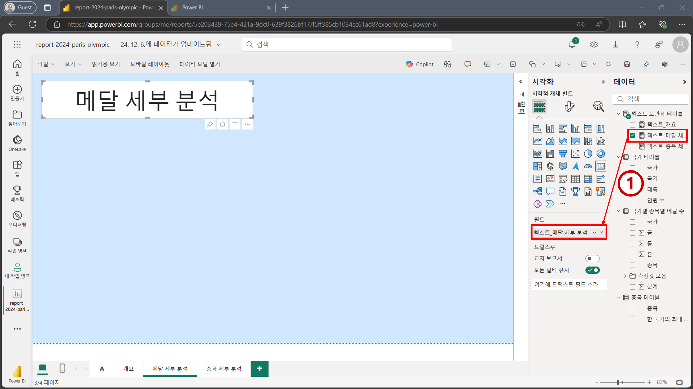

3. 비어 있는 캔버스를 클릭한 뒤, 아래 이미지의 1번을 참고하여 테이블 시각적 개체를 캔버스에 추가합니다. 그리고 적절한 크기로 조절하고 적절한 위치로 배치합니다.
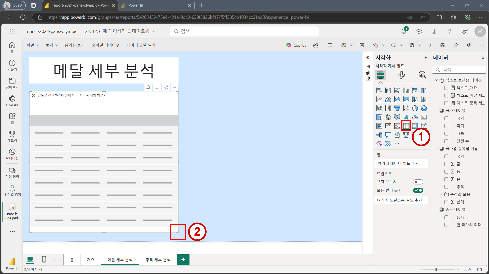

4. 아래 이미지를 참고하여 테이블 시각적 개체에 필요한 필드들을 추가합니다.

5. `국기` 필드에 시각화된 국기의 크기를 조절하기 위해 아래 이미지를 참고하여 `이미지 크기` 메뉴로 이동합니다. 그리고 나서 `높이`와 `너비`를 각각 `22`로 편집합니다.
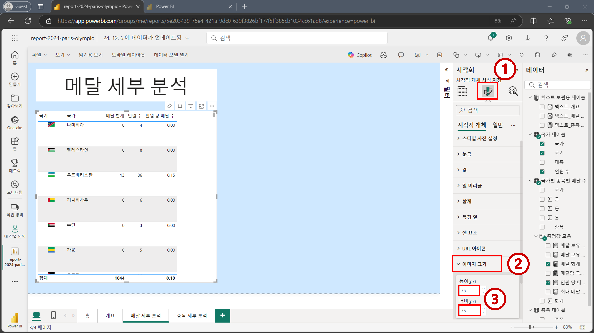

6. `국기` 필드의 크기는 적절하게 조절되었습니다. 허나 테이블 시각적 개체 내에 있는 값들과 열 이름이 너무 작습니다. 폰트 사이즈를 편집하기 위해 `값` 메뉴로 이동하여 폰트 사이즈를 `15`로 변경합니다.
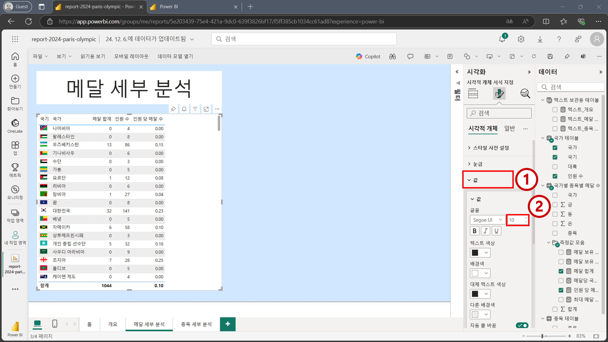

7. 마찬가지로 `열 머리글` 메뉴로 이동하여 폰트 사이즈를 `15`로 변경합니다.
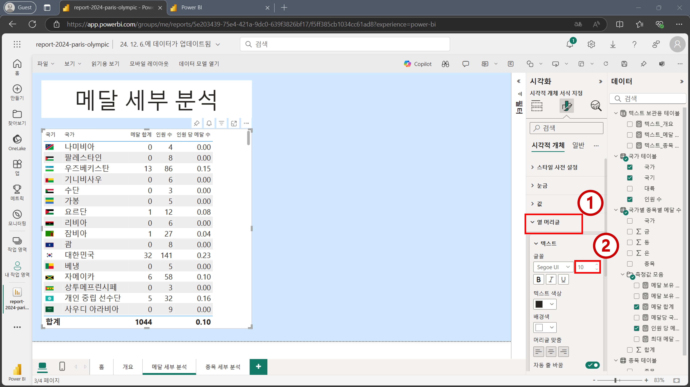

8. 테이블 시각적 개체의 폰트 사이즈는 적절하게 변경되었습니다. 허나 `인원 수` 열에 합계가 표시되지 않고 있습니다. `인원 수` 필드를 클릭하여 집계 방법을 `합계`로 변경합니다.
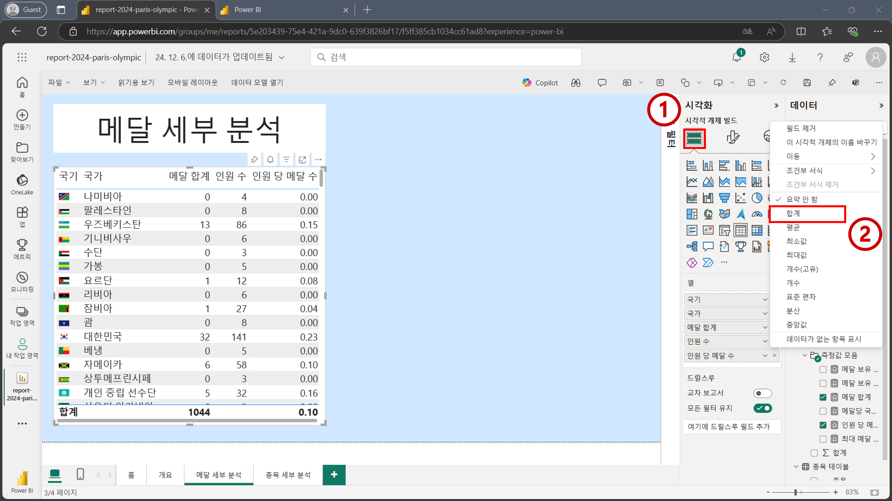

9. `합계`로 변경 되면서 필드명이 `합계 인원 수개`로  변했습니다. 해당 필드명을 더블 클릭하여 다시 `인원 수`로 수정합니다. 테이블 시각적 개체에 있는 `메달 합계` 및 `합계 인원 수개` 열에 해당하는 합계에 천 단위 구분자가 있으면 가독성이 더 좋을것 같습니다. 또한 `인원 당 메달 수` 또한 소수점 3째자리 까지 표시하고자 합니다. 서식을 변경하기 위해 의미 체계 모델을 편집하고 있었던 탭으로 이동합니다.

10. `'국가 테이블'[인원 수]` 필드와 `'국가별 종목별 메달 수'[메달 합계]` 필드를 동시 선택합니다. 그리고 `속성` 패널에서 `천단위 구분 기호`를 클릭하여 활성화 시킵니다.

11. `'국가별 종목별 메달 수'[인원 당 메달 수]`를 클릭합니다. `속성` 패널에서 `소수 자릿수`란에 `3`을 입력하고 비어 있는 공간을 한 번 클릭합니다. 그리고 나서 다시 보고서 편집을 하던 탭으로 돌아옵니다.

12. 원하던 서식 변경이 다 이뤄진 것을 확인할 수 있습니다. 테이블 시각적 개체에 있는 `인원 수` 열 이름을 클릭하면 내림차순, 한번 더 클릭하면 오름차순으로 정렬할 수 있습니다. 여러 번 클릭해 보면서 내림차순으로 설정을 해둡니다.
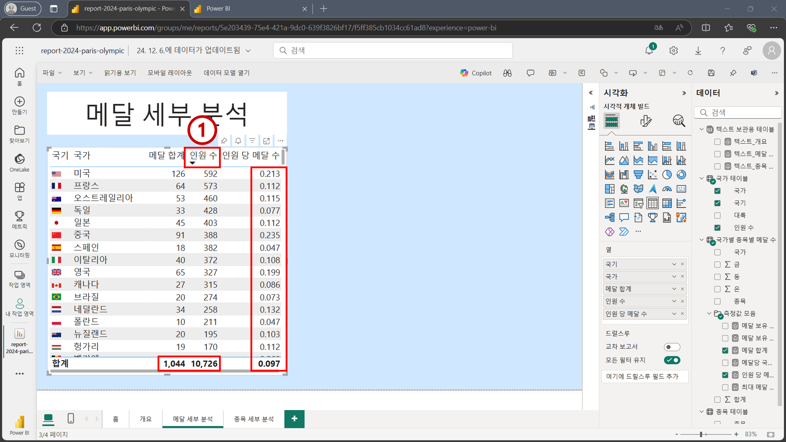

13. 다음으로는 `인원 당 메달 수` 열에 있는 값을 더 직관적으로 이해하기 위해 아래 이미지를 참고하여 `조건부 서식` > `배경색`으로 이동합니다.
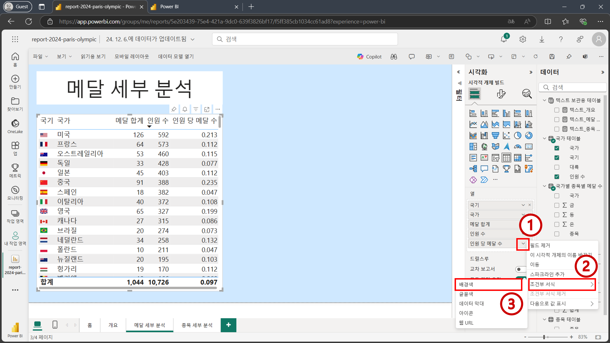

14. 아래 이미지를 참고하여 `최소값`과 `최대값`의 색상을 적절한 색으로 편집합니다. 추천하는 값은 `최소값` 같은 경우는 `#FFFB1B`이며, `최대값`은 `FF0000`입니다. 해당 컬러 코드를 `다른 색`(2번) 버튼을 누르면 열리는 창에서 `헥스`란에 입력하면 됩니다.

15. 색 설정이 완료된 후 `확인`을 누릅니다.
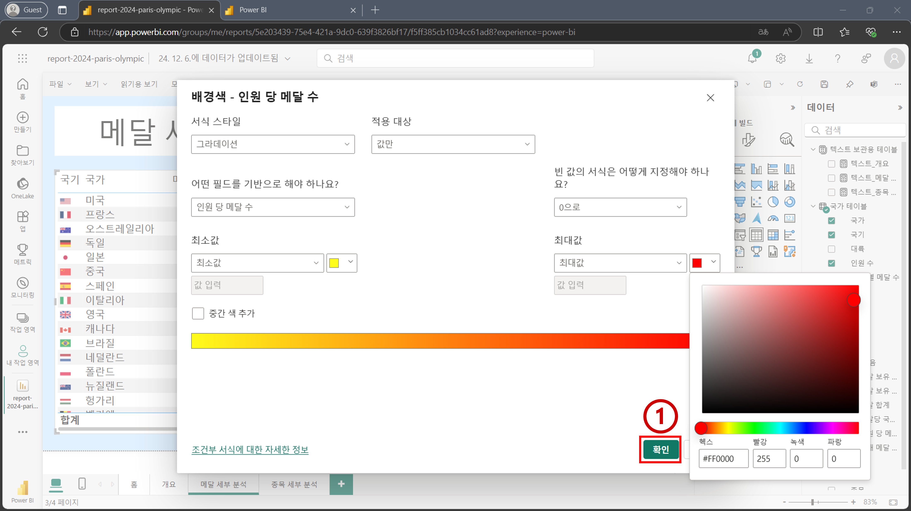

16. 아래 이미지 처럼 `인원 당 메달 수`열에 값에 따른 색이 배경색으로 들어간 것을 확인할 수 있습니다. 테이블 시각적 개체를 살펴보며 대한민국의 특징을 분석해봅니다. 대한민국은 올림픽 참가 인원 수가 100명 이상인 국가 중에서 `인원 당 메달 수`, 즉 메달 획득의 효율이 2번째로 가장 좋은 것을 확인하실 수 있습니다. 새로운 테이블을 추가하기 위해 비어 있는 공간을 한 번 클릭한 후, 아래 이미지를 참고해 테이블 시각적 개체를 추가합니다.

## 6.2 대륙별 메달 보유 국가 비율 시각화

1. 테이블 시각적 개체가 추가되면 아래 이미지를 참고하여 적절한 필드들을 추가합니다.
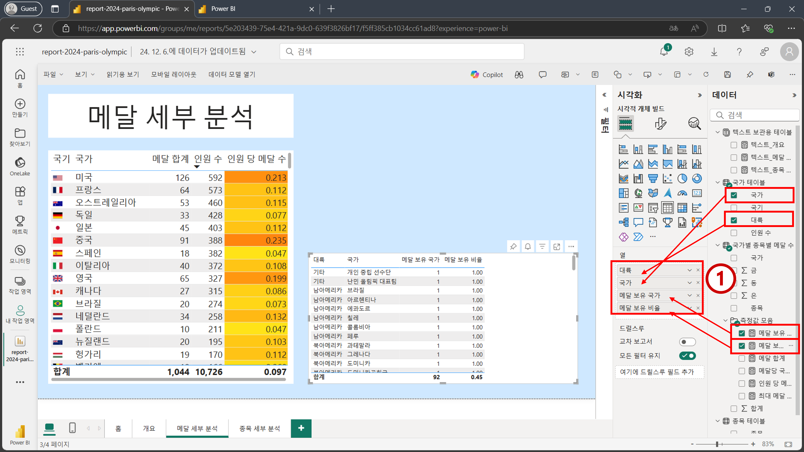

2. 추가된 `'국가 테이블'[국가]` 필드가 정상적으로 집계가 되지 않고 있기 때문에 `국가`필드의 집계 방법을 `개수(고유)`로 편집합니다.
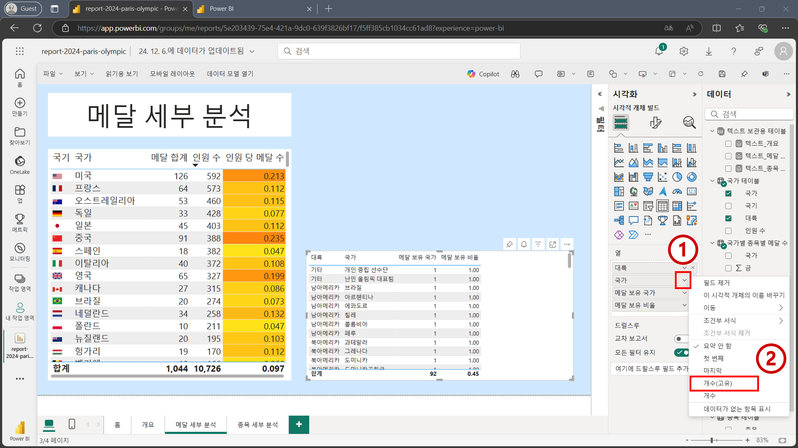

3. 테이블 시각적 개체의 폰트 사이즈를 아래 이미지를 참고하여 편집합니다.
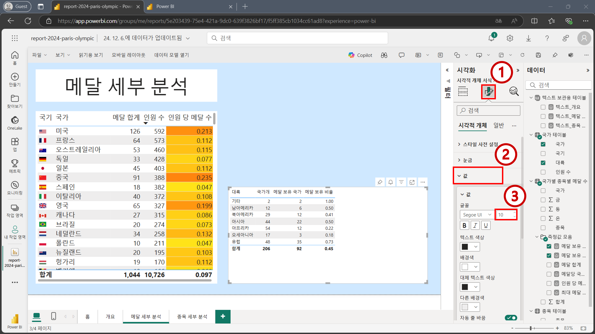

4. 열 머리글의 폰트 사이즈 또한 아래 이미지 참고하여 업데이트를 한 후, 백분율 서식을 변경하기 위해 데이터 모델링 탭으로 다시 이동합니다.
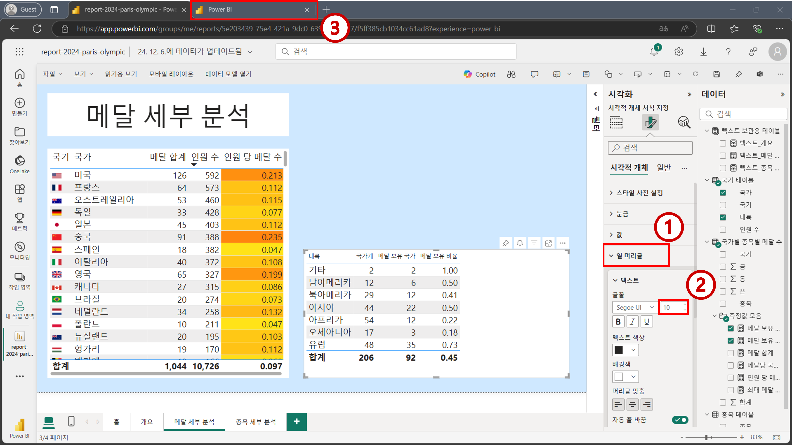

5. `'국가별 종목별 메달 수'[메달 보유 비율]` 필드를 클릭한 후 `속성` 패널에서 `백분율 형식`을 클릭하여 활성화 합니다. 그리고 다시 보고서 편집 탭으로 이동합니다.
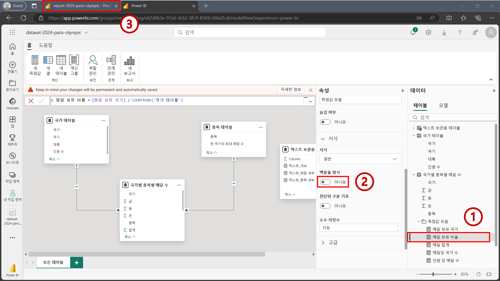

6. `메달 보유 비율` 열의 백분율 서식이 잘 나오는 것을 확인할 수 있습니다. `국가개`열을 클릭하여 테이블을 내림차순 정렬합니다. 그리고 비어 있는 캔버스를 클릭한 뒤 아래 이미지를 참고하여 슬라이서 시각적 개체를 추가합니다.
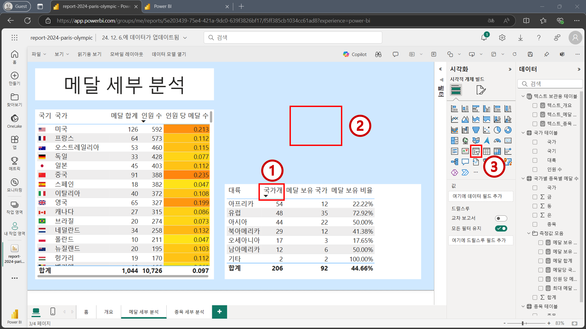

## 6.3 슬라이서 추가하기

1. 슬라이서 시각적 개체는 데이터들을 필터링 해서 볼 때 사용합니다 추가된 슬라이서 개체를 선택하고 필드에는 `'국가 테이블'[대륙]` 필드를 드래그 앤 드롭하여 추가합니다.
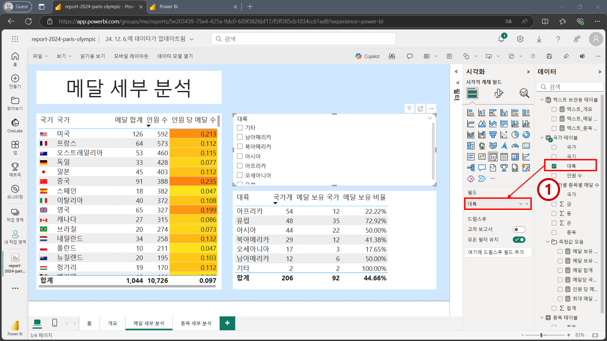

2. `슬라이서 설정`을 `타일`로 변경합니다.
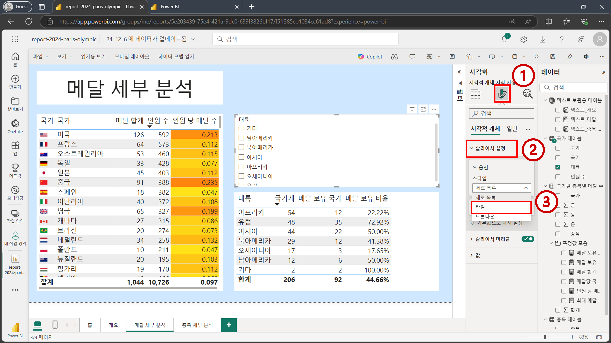

3. 슬라이서를 눌러 보면서 필터링된 데이터들이 시각화된 결과를 확인해봅니다. 확인이 완료되면 종목 세부 분석 페이지 구축을 위한 준비를 합니다. `메달 세부 분석` 카드 시각적 개체를 클릭한 뒤 복사(Ctrl + C) 합니다. 그리고 `종복 세부 분석` 버튼을 눌러 해당 페이지로 이동합니다.
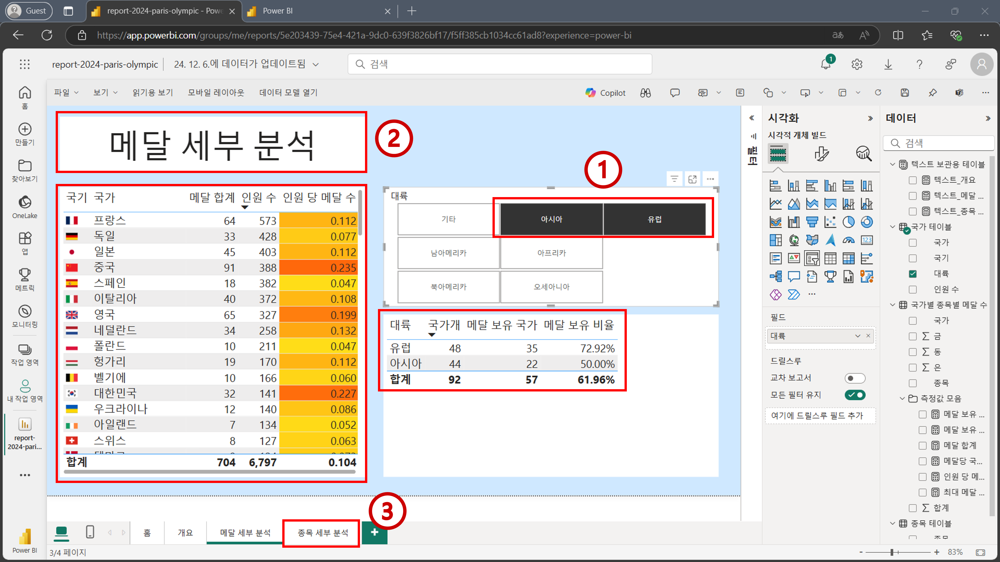

축하합니다. 데이터 시각화 세번째 파트를 모두 완료하셨습니다.