# STEP 07: 데이터 시각화 part4

이번 실습에서는 종목 세부 분석 페이지를 구축해보겠습니다.

## 7.1 분산형 차트 추가하기

1. 붙여넣기(Ctrl + V)를 실행하여 앞서 복사해온 카드 시각적 개체를 추가합니다. 그리고 `필드`에 있는 `텍스트_메달 세부 분석` 필드를 제거합니다.
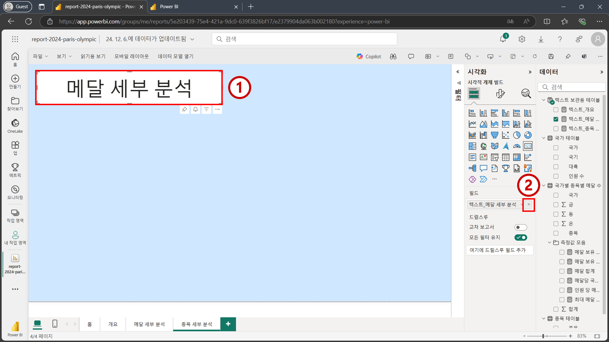

2. `텍스트_종목 세부 분석` 필드를 카드 시각적 개체에 추가합니다. 그리고 비어 있는 캔버스를 한번 클릭한 후 아래 이미지의 3번을 참고하여 분산형 차트를 추가합니다.
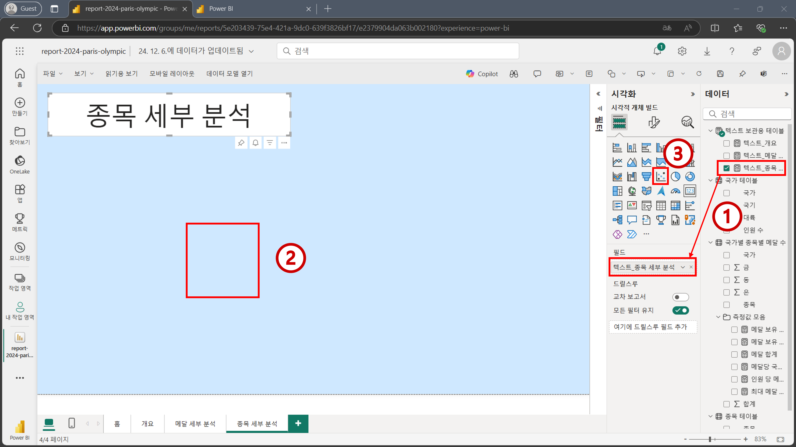

3. 아래 이미지를 참고하여 적절한 필드들을 분산형 차트의 적절한 위치에 추가합니다.
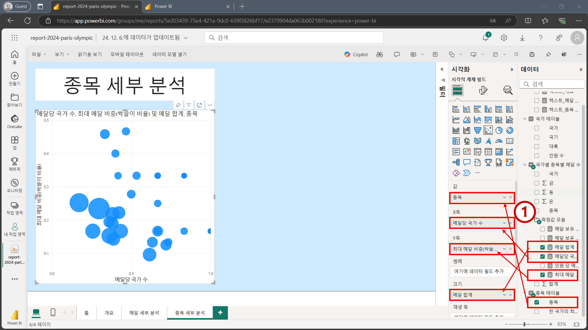

4. 아래 이미지를 참고하여 `범주 레이블`을 활성화 합니다. 그리고 분산형 차트에 있는 거품 위에 마우스를 올려보면 `최대 메달 비중(싹쓸이 비율)` 값이 소수점으로 나오고 있습니다. 백분율로 만들어 주기 위해 데이터 모델링 탭으로 다시 이동합니다.
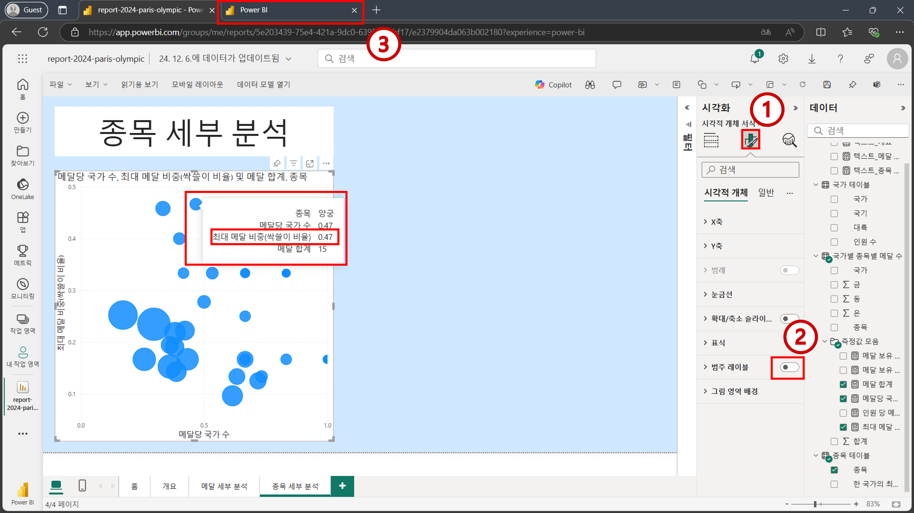

5. `최대 메달 비중(싹쓸이 비율)` 필드를 클릭한 후 `백분율 형식`을 활성화 합니다. 그리고 다시 보고서 편집 화면으로 돌아갑니다.
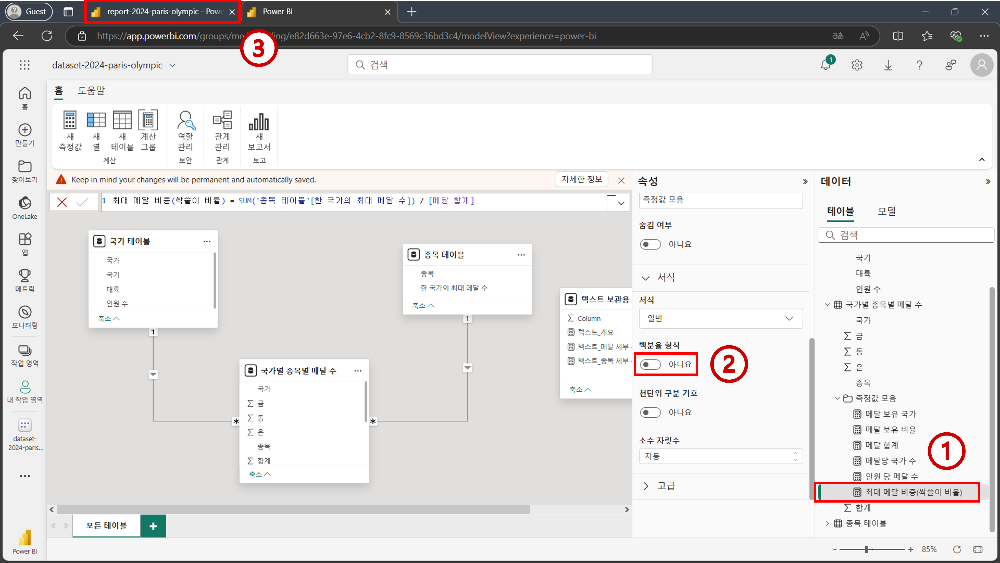

6. `최대 메달 비중(싹쓸이 비율)` 값이 백분율 형태로 나오는 것을 확인합니다. 그리고 비어 있는 캔버스를 한번 눌러주고 아래 이미지의 2번을 참고하여 `누적 세로 막대형 차트`를 추가합니다.
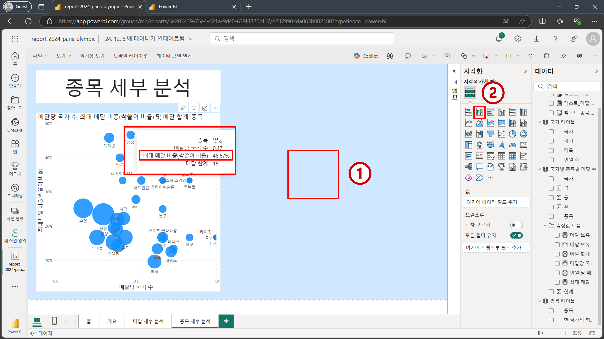

## 7.2 누적 세로 막대형 차트 추가하기

1. 아래 이미지를 참고하여 적절한 필드들을 `누적 세로 막대형 차트`에 추가합니다.
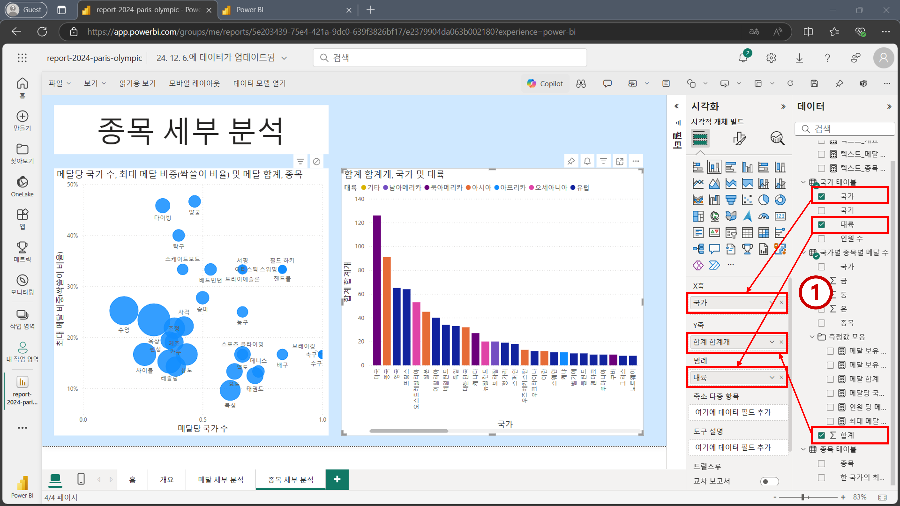

2. 분산형 차트에 있는 거품 중 한 개를 클릭합니다. Power BI 특성 상 시각적 개체간 상호작용이 기본으로 활성화 되어 있기 때문에 막대 그래프에도 필터링이 적용되어 '양궁' 종목에 해당하는 메달 데이터만 강조 표시 되는 것을 확인할 수 있습니다. 
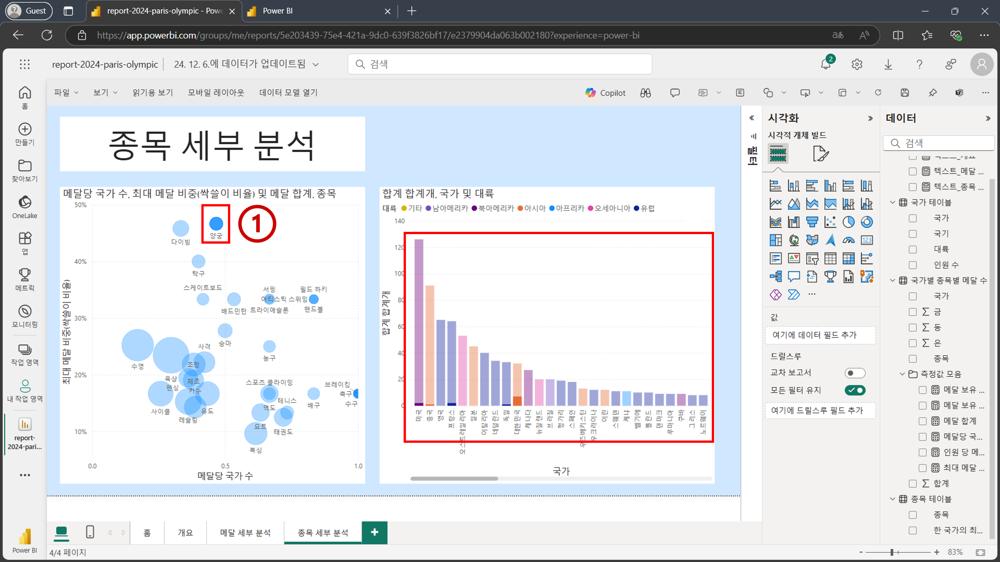

3. 좀 더 접근성 좋게 하기 위해 강조 표시 되신 필터링이 되도록 변경해보겠습니다. 분산형 차트를 클릭한 후 아래 이미지를 참고하여 `상호 작용 편집` 기능을 활성화 합니다.
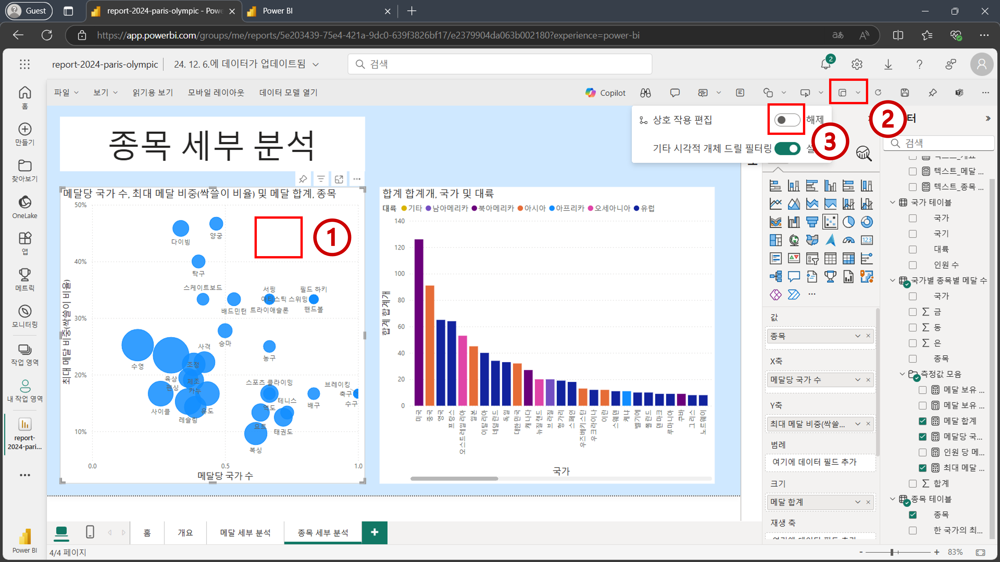

4. 활성화가 된 후 막대형 차트 위에 아이콘들이 표시되는 것을 확인할 수 있습니다. 아래 이미지를 참고하여 적절한 아이콘을 클릭한 후 분산형 차트 상의 거품을 다시 한 번 눌러줍니다.
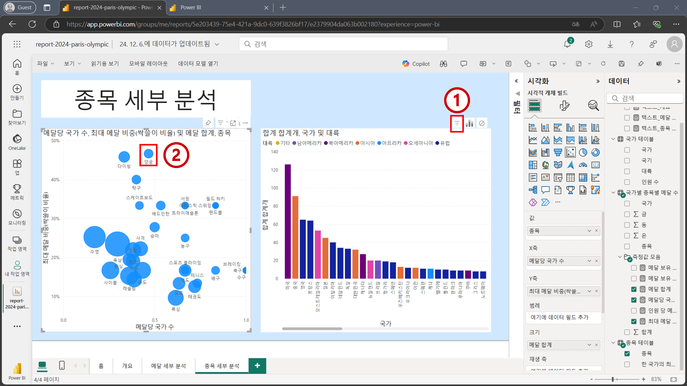

5. 이제는 강조 표시가 아니라 필터링이 되어서 특정 종목에서 메달을 수상한 국가들만 시각화 된 것을 볼 수 있습니다. 상호 작용 편집 기능은 더 이상 필요 없기 때문에 아래 이미지를 참고하여 비활성화 하겠습니다. 
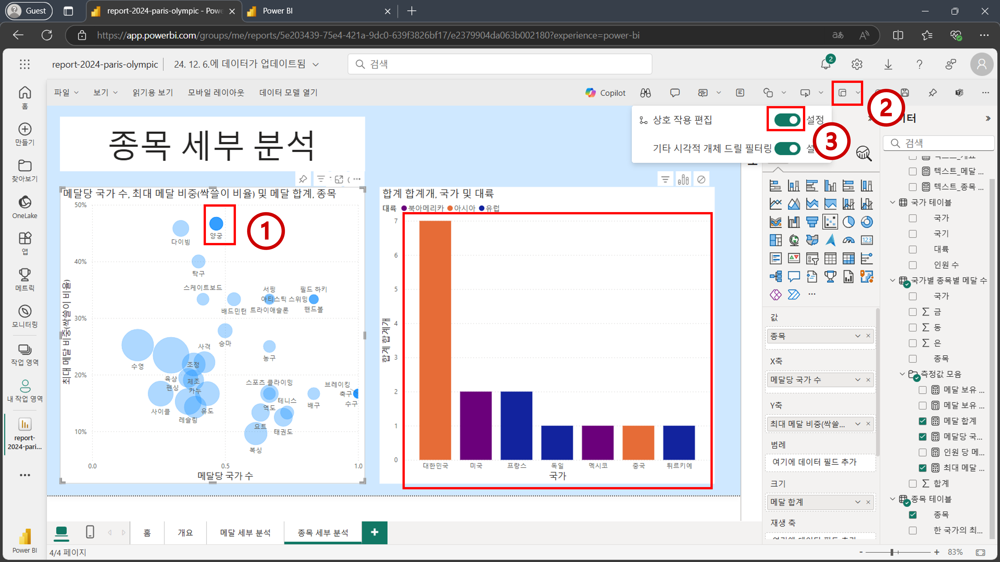

```{Tip}
비활성화 하지 않으면 시각적 개체 우측 상단에 아이콘이 계속 나타나므로, 작업 중 불편할 수 있습니다.
```

6. 막대 그래프 상에 있는 막대 위에 마우스를 올려 보면 `합계 합계개` 부분을 통해 특정 국가가 특정 종목에 대해 획득한 메달 개수를 확인할 수 있습니다. 해당 부분을 백분율로 보기 위해선 아래 이미지를 참고하여 `총합계의 백분율`을 선택합니다.
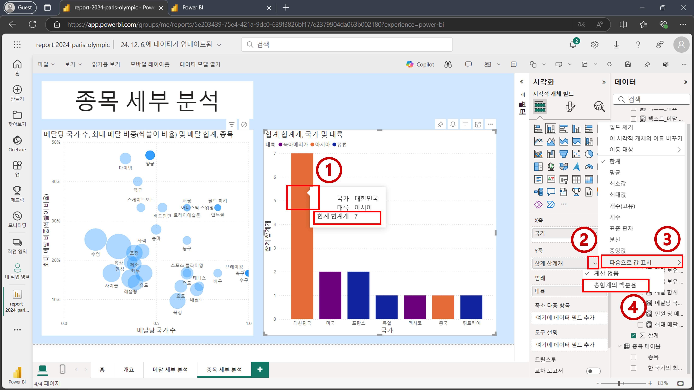

7. 백분율로 나타나는 것을 아래 이미지를 통해 확인할 수 있습니다. 백분율과 이전에 나왔던 메달 개수를 함께 표시하고자 한다면 아래 이미지를 참고하여 `'국가별 종목별 메달 수'[합계]` 필드를 `도구 설명`에 추가합니다.
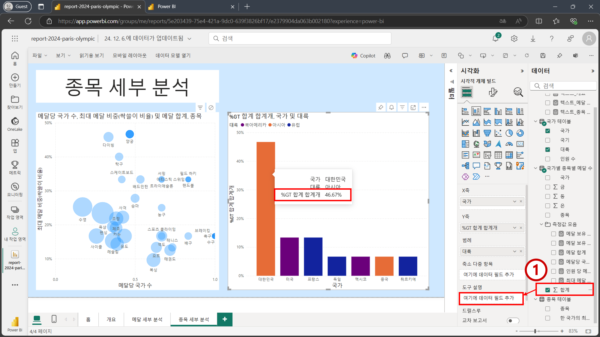

8. 백분율과 메달 개수가 함께 막대 그래프 상에 나오는 것을 확인할 수 있습니다. 이제 아래 이미지를 참고하여 그래프들의 제목을 수정하겠습니다. 분산형 차트는 `종목별 메달당 국가 수 및 싹쓸이 비율`로 편집하고 막대 그래프는 `국가별 메달 비중`으로 편집합니다.
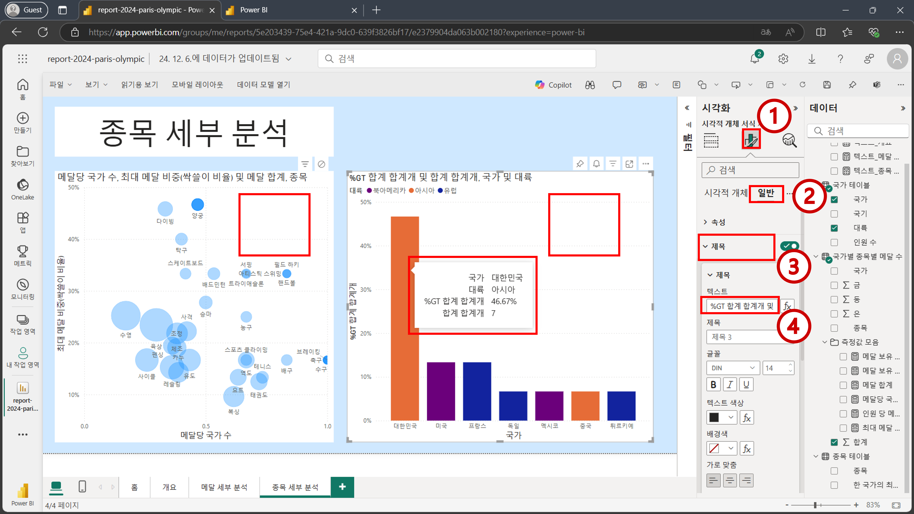

9. `홈` 버튼을 클릭해서 `홈` 페이지로 이동합니다. 그리고 나서 아래 이미지를 참고하여 우측 상단에 저장 버튼을 눌러 줍니다.
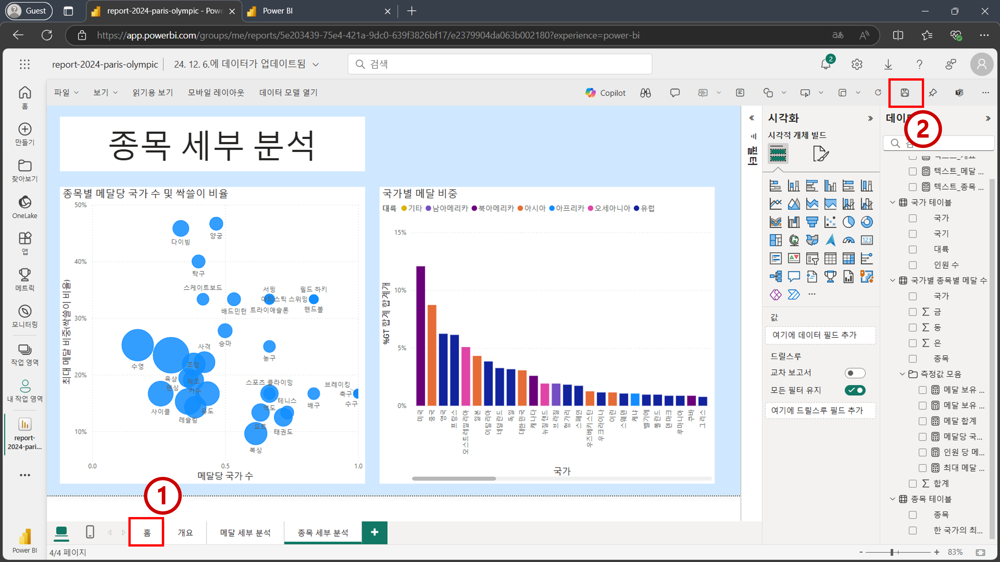

```{Tip}
저장 버튼을 눌렀을 때 위치하고 있던 페이지가 랜딩 페이지로 설정 됩니다.
```

10. 저장이 완료되면 좌측 상단의 `읽기용 보기`를 누릅니다.
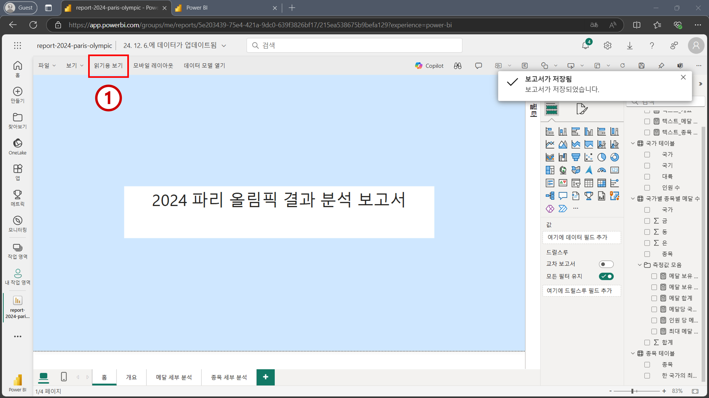

11. 편집화면에서 빠져 나왔습니다. 현재 화면은 회사 내에서 해당 보고서를 공유할 때 공유 받은 사람이 보게 되는 화면과 같습니다. 좌측 `페이지` 메뉴를 탐색하여 구축한 보고서를 맘껏 탐색해 보세요!
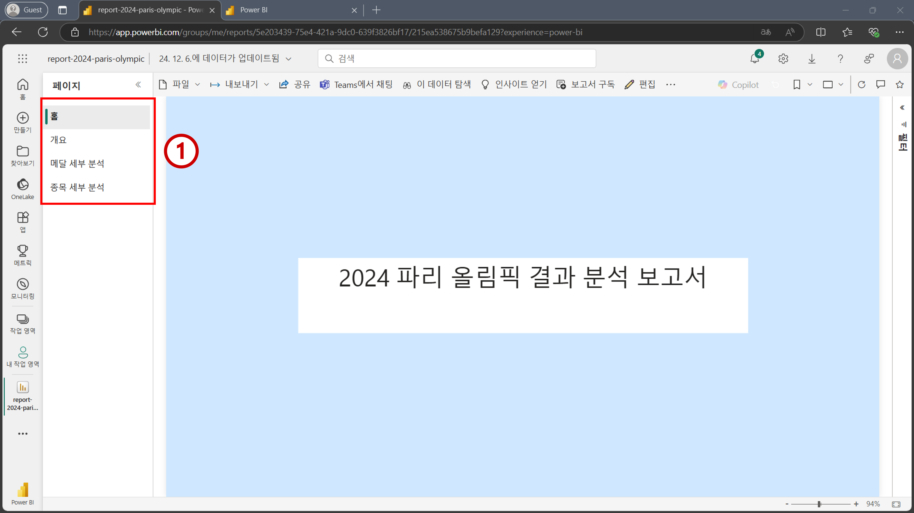

축하합니다! 워크샵을 모두 완료하셨습니다.

